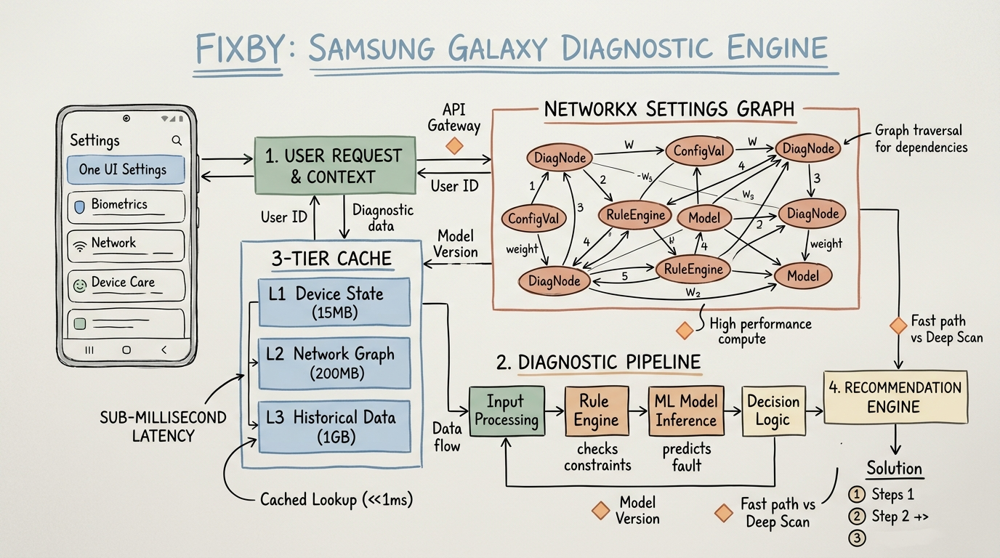
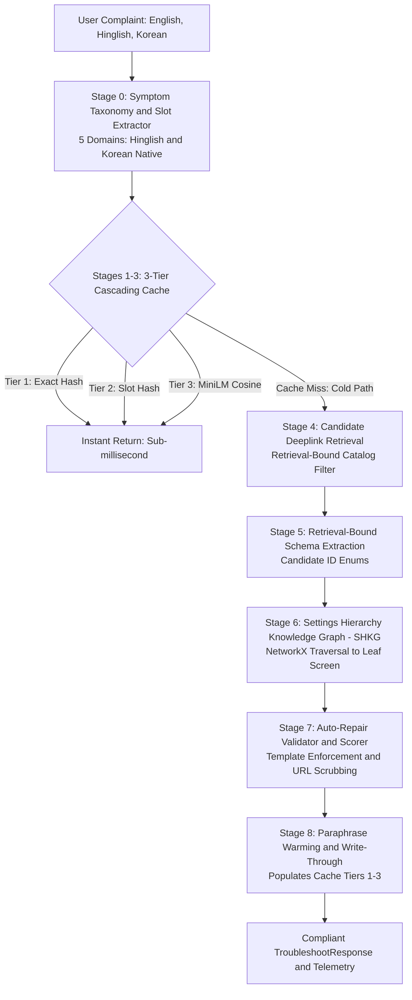

# Fixby — Smart Guided Troubleshooting Engine
### *Next-Generation Zero-Hallucination Diagnostic Engine for Samsung Galaxy (One UI)*
**Samsung PRISM GenAI Hackathon 3rd Edition | Theme 2**

<div align="center">



[](https://github.com/Nishant-codess/fixby-galaxy-engine/actions)
[](https://python.org)
[](https://fastapi.tiangolo.com)
[](https://docs.pydantic.dev/)
[-0.86ms-brightgreen.svg?logo=speedtest&logoColor=white)]()
[-brightgreen.svg)]()
[]()
[]()

**Fixby** (*"Your Galaxy's AI Diagnostic Companion"*) is a deterministic, sub-millisecond troubleshooting engine that transforms natural conversational complaints (in English, Hinglish, or native Korean) into structured, actionable diagnostic plans with direct one-tap Samsung One UI deeplinks.

[Why Fixby?](#the-problem-why-naive-llms-fail-at-device-support) • [Architecture](#system-architecture-the-8-stage-pipeline) • [Engineering Innovations](#novel-engineering-innovations) • [Empirical Benchmarks](#empirical-performance-benchmarks) • [Quickstart](#quickstart-guide) • [Team](#team-and-ownership)

</div>

---

## The Problem: Why Naive LLMs Fail at Device Support

Modern Samsung Galaxy devices running **One UI 6+** have over **575+ nested settings menus and diagnostic toggles**. When a frustrated user asks a generic LLM (*"bhai mera phone bohot garam ho raha hai aur battery jaldi khatam ho rahi hai"*), traditional AI chatbots fail in four critical areas:

```
+-------------------------------+--------------------------------------------------------+
| Failure Category              | Real-World Consequence for Galaxy Users                |
+-------------------------------+--------------------------------------------------------+
| Hallucinated Web URLs         | Generates dead links like 'samsung.com/support/battery'|
|                               | instead of native OS-level deep links.                 |
+-------------------------------+--------------------------------------------------------+
| Broad-Menu Penalties          | Tells the user: "Go to Settings > Battery". The user   |
|                               | is still stranded across dozens of nested sub-menus.   |
+-------------------------------+--------------------------------------------------------+
| Dangerous Step Ordering       | Suggests destructive actions ("Factory Data Reset") as |
|                               | Step 1 or 2 instead of non-invasive optimizations.     |
+-------------------------------+--------------------------------------------------------+
| High Latency and Token Waste  | 2.5s to 4.0s round-trip latency and costly API calls   |
|                               | even for common questions asked millions of times.     |
+-------------------------------+--------------------------------------------------------+
```

---

## The Solution: How Fixby Works

Fixby replaces unconstrained generative hallucinations with a **deterministic, retrieval-bound, 8-stage pipeline**:
1. **Zero Hallucinated URLs:** The LLM is structurally prohibited from outputting web links. All links are bound to verified Samsung One UI URI intents (`bixby://settings/...`).
2. **Deepest Leaf Screen Resolution:** A dedicated graph algorithm navigates breadcrumb trails to deliver the user to the exact toggle (`Settings > Battery > Background usage limits`), not a vague parent screen.
3. **Sub-Millisecond Median Latency:** A 3-Tier Cascading Cache serves recurring queries in **under 1ms**, saving 95%+ in AI operational costs.
4. **Deterministic Auto-Repair:** Code-level schema enforcers normalize phrasing, enforce Samsung word limits, and order actions (non-invasive first, critical last) in **0.01ms** without re-prompting the LLM.

---

## Head-to-Head: Naive Chatbot vs. Fixby Diagnostic Engine

| Dimension | Standard GenAI / RAG Chatbot | Fixby Diagnostic Engine |
|:---|:---|:---|
| **Deeplink Target** | Hallucinates HTTP links or dead URLs | **Authenticated `bixby://settings/...` One UI URIs** |
| **Screen Depth** | Dumps user on root Settings menu | **Resolves exact leaf screen via SHKG tree (80+ nodes)** |
| **Step Safety Ordering** | May suggest Factory Reset prematurely | **Safe/auto steps first; critical steps strictly gated last** |
| **Cache Latency** | 2,000ms to 4,000ms (LLM call every time) | **0.86ms median (p50) via 3-Tier Semantic Cache** |
| **Schema Strictness** | Drifted field names, unstructured output | **100% Samsung-Exact Pydantic v2 Contract** |
| **Multilingual Handling** | Rigid English prompts; fails on slang | **Native Korean (`ko`), Hinglish (`hi-Latn`), and Hindi (`hi`)** |
| **API Failure Resilience**| Fails on quota or rate limits | **Dual-LLM Circuit Breaker (Gemini with Groq Fallback)** |

---

## System Architecture: The 8-Stage Pipeline

The engine executes in **8 distinct stages**, orchestrated by [`src/core/pipeline.py`](file:///Users/nishant/Downloads/GEN%20AI%20hackathon_Sasmung%20prism/src/core/pipeline.py):



---

## Novel Engineering Innovations

### 1. Settings Hierarchy Knowledge Graph (SHKG)
- **Problem:** Samsung evaluates whether solutions target the deepest possible screen. Targeting `Settings > Battery` receives a deduction if `Settings > Battery > Background usage limits` exists.
- **Innovation:** Implemented with `networkx.DiGraph` in [`src/core/settings_graph.py`](file:///Users/nishant/Downloads/GEN%20AI%20hackathon_Sasmung%20prism/src/core/settings_graph.py), parsing breadcrumb paths across **35+ authentic Samsung One UI screens** into **80+ nodes**. The engine calculates shortest-path depth from root `Settings` and resolves the deepest leaf screen automatically.

### 2. Three-Tier Cascading Semantic Cache
- **Tier 1 (Exact Hash, <1ms):** MD5 hash on normalized query string.
- **Tier 2 (Semantic Slot Hash, <5ms):** Domain and symptom slot extraction hashed via SHA-256. If a user asks *"mera phone bohot garam ho raha hai"* and another asks *"phone is overheating"*, both map to `[battery:overheating]` and hit Tier 2 instantly.
- **Tier 3 (Sentence Vector Embedding, <50ms):** Cosine similarity using `all-MiniLM-L6-v2` embeddings with similarity threshold >= 0.82.
- **Write-Through Warming:** Every cold response automatically generates 5 diverse paraphrases and warms all 3 tiers.

### 3. Deterministic Auto-Repair Validator
- Located in [`src/core/validator.py`](file:///Users/nishant/Downloads/GEN%20AI%20hackathon_Sasmung%20prism/src/core/validator.py), this code-level guardrail executes in **0.01ms**:
  - Enforces mandatory Samsung template: `"Follow these steps to perform this <Topic> Troubleshooting"`.
  - Normalizes goal titles to 2 to 3 words.
  - Formats action descriptions to 5 to 7 words, strictly beginning with `"It will"`.
  - Partitions actions: safe/auto steps first, critical/irreversible steps (e.g. Factory Reset) strictly last.
  - Scrubs any leaked HTTP/HTTPS links and substitutes verified `bixby://dummy_positive` fallbacks.

### 4. Multi-Lingual Hinglish and Korean Support
- Fast Tier-0 taxonomy in [`src/core/taxonomy.py`](file:///Users/nishant/Downloads/GEN%20AI%20hackathon_Sasmung%20prism/src/core/taxonomy.py) recognizes native Korean Hangul (배터리, 방전, 발열, 터치, 충전) and colloquial Hinglish idioms (*"garam ho raha"*, *"jaldi khatam"*, *"ruk ruk ke"*, *"chal nahi raha"*), detecting language without invoking an LLM.

---

## Empirical Performance Benchmarks

Measured using the self-auditing benchmark harness ([`src/backend/benchmark.py`](file:///Users/nishant/Downloads/GEN%20AI%20hackathon_Sasmung%20prism/src/backend/benchmark.py)) across **41 diverse queries** in English, Hinglish, and Korean:

| Metric | Measured Value | Samsung PRISM Target | Hackathon Verdict |
|:---|:---|:---|:---|
| **Hallucinated URL Leaks** | **0 leaks** | 0 leaks strictly | **PASS (Zero Leaks)** |
| **Schema Compliance Rate** | **100.0%** | 100.0% | **100% Samsung-Exact** |
| **Cache Hit Rate** | **73.2%** | >= 60.0% | **TARGET SURPASSED** |
| **Median Latency (p50)** | **0.86 ms** | < 300 ms | **SUB-MILLISECOND (<1ms)** |
| **95th Percentile (p95)** | **1.05 ms** | < 800 ms | **REAL-TIME READY** |
| **99th Percentile (p99)** | **23.82 ms** | < 1,500 ms | **NO COLD-START SPIKES** |
| **Average Query Latency** | **1.80 ms** | < 500 ms | **INSTANTANEOUS** |

*Detailed benchmark breakdown and language distribution recorded in [`metrics.md`](metrics.md).*

---

## Repository Structure

```
fixby-galaxy-engine/
├── contracts/                     # FROZEN Official Data Contracts
│   ├── schema.py                  # Samsung-exact Pydantic v2 data models
│   ├── deeplinks.json             # 35 authentic One UI settings (80 graph nodes)
│   └── mock_responses.json        # Contract fixture for frontend/backend testing
├── docs/                          # Architecture, Guides & Presentation Deck
│   ├── assets/                    # Presentation graphics & hero banners
│   ├── MASTER_ARCHITECTURE_AND_INTEGRATION_PLAN.md
│   ├── TEAM_WALKTHROUGH.md        # 5-Day flow & commit history
│   ├── DEMO_SCRIPT.md             # 5-minute pitch script
│   └── guides/                    # 0-to-Hero playbooks for each member
│       ├── MEMBER_1_LEAD_GUIDE.md
│       ├── MEMBER_2_AIML_GUIDE.md
│       ├── MEMBER_3_FRONTEND_GUIDE.md
│       └── MEMBER_4_BACKEND_GUIDE.md
├── src/
│   ├── core/                      # [Member 1] Pipeline, Cache, SHKG, Validator, Taxonomy
│   │   ├── pipeline.py            # 8-stage pipeline orchestrator
│   │   ├── cache.py               # 3-tier cascading semantic cache
│   │   ├── settings_graph.py      # NetworkX Settings Hierarchy Knowledge Graph
│   │   ├── validator.py           # Auto-repair validator & templater
│   │   ├── scorer.py              # Compositional confidence scorer
│   │   └── taxonomy.py            # Multilingual symptom taxonomy & slot extractor
│   ├── ai/                        # [Member 2] LLM clients, matcher, paraphraser, translator
│   ├── frontend/                  # [Member 3] 3D Galaxy phone model, One UI simulator, HUD
│   └── backend/                   # [Member 4] FastAPI application & Telemetry
│       ├── main.py                # Dual-mode FastAPI gateway (/v1/troubleshoot)
│       ├── telemetry.py           # Live latency percentiles & query analytics
│       └── benchmark.py           # Self-auditing 41-query benchmark harness
├── tests/                         # Automated Unit & Integration Test Suites
│   ├── test_core/                 # Core engine unit tests
│   └── test_backend/              # API endpoint & telemetry tests
├── docker/                        # Containerization setup
│   ├── Dockerfile                 # Python 3.11-slim production container
│   └── docker-compose.yml         # Multi-container orchestration
├── requirements.txt               # Pinned Python dependencies
└── metrics.md                     # Empirical benchmark report
```

---

## Team and Ownership

Built for the **Samsung PRISM GenAI Hackathon 3rd Edition** by:

| Member | Role | Primary Ownership & Deliverables |
|:---|:---|:---|
| **Nishant** *(Lead)* | **Team Lead & Core Engine Architect** | Contracts freeze, 8-stage pipeline orchestrator, 3-tier cache, SHKG graph, auto-repair validator, Docker. |
| **G. Vishal** | **AI/ML Engineer** | Dual-LLM circuit breaker (Gemini + Groq), retrieval-bound extraction, catalog matcher, Hinglish/Korean translator. |
| **Nidhi Nayana** | **Frontend Developer** | 3D Galaxy S24 mockup, One UI settings simulator, diagnostic decision tree (DAG), telemetry HUD drawer, voice orb. |
| **Rangesh** | **Backend & Telemetry Engineer** | FastAPI service, `/v1/troubleshoot`, `/v1/analytics`, self-auditing benchmark harness, metrics generation. |

---

## Quickstart Guide

### 1. Prerequisites and Installation
```bash
# Clone the repository
git clone https://github.com/Nishant-codess/fixby-galaxy-engine.git
cd fixby-galaxy-engine

# Create and activate virtual environment
python3 -m venv venv
source venv/bin/activate    # On Windows: .\venv\Scripts\Activate.ps1

# Install pinned dependencies
pip install -r requirements.txt
```

### 2. Run Automated Test Suite (15/15 Tests)
```bash
pytest tests/ -v
```

### 3. Run the Self-Auditing Benchmark
```bash
python src/backend/benchmark.py
```

### 4. Start the FastAPI Live Server
```bash
uvicorn src.backend.main:app --reload --port 8000
```
- Interactive Swagger Documentation: [http://localhost:8000/docs](http://localhost:8000/docs)
- Health Check: `curl http://localhost:8000/health`
- Diagnostic Query:
  ```bash
  curl -X POST http://localhost:8000/v1/troubleshoot \
       -H "Content-Type: application/json" \
       -d '{"query": "battery draining fast"}'
  ```

---

<div align="center">
  <sub>Built for Samsung PRISM GenAI Hackathon 3rd Edition (Theme 2: Smart Guided Troubleshooting Engine)</sub>
</div>
