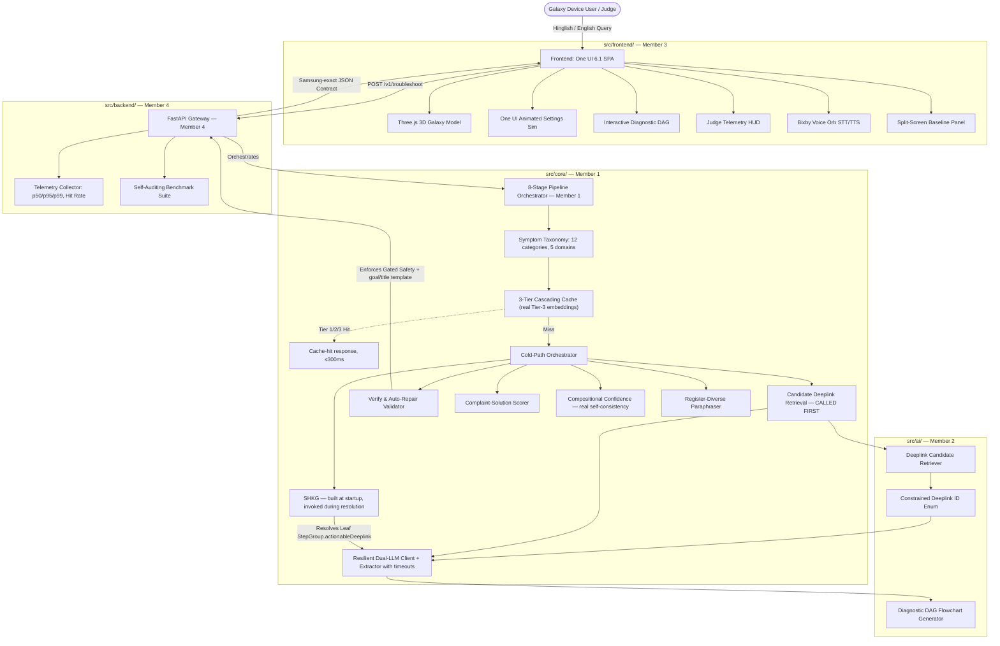

# 🚀 Fixby — Final Master Architecture & Integration Plan
### *Smart Guided Troubleshooting Engine for Samsung Galaxy*
### Samsung PRISM GenAI Hackathon 3rd Edition | Theme 2
**Document Version:** 4.0.0-FINAL  
**System Status:** Post-Audit Corrected Specification  
**Target Submission Tag:** `PRISM_GENAI_HACKATHON_Y2026`  
**Supersedes:** v3.0.0-PROD, plan.md loophole audit (all 20 findings incorporated)

---

## Table of Contents

1. [Executive Summary & Architectural Philosophy](#1-executive-summary--architectural-philosophy)
2. [Complete Innovation Portfolio (20 Innovations)](#2-complete-innovation-portfolio-20-innovations)
3. [High-Level System Architecture & Component Topology](#3-high-level-system-architecture--component-topology)
4. [The 8-Stage Pipeline — Corrected Execution Sequence](#4-the-8-stage-pipeline--corrected-execution-sequence)
5. [Official Data Contract (`contracts/schema.py`) — Samsung-Exact](#5-official-data-contract-contractsschemapy--samsung-exact)
6. [Detailed Algorithmic & Mathematical Specifications](#6-detailed-algorithmic--mathematical-specifications)
7. [The 6 Visible Innovations (Judge Experience Architecture)](#7-the-6-visible-innovations-judge-experience-architecture)
8. [Backend API Layer](#8-backend-api-layer)
9. [Monorepo Structure & File Ownership Matrix](#9-monorepo-structure--file-ownership-matrix)
10. [Environment, Secrets & `.gitignore`](#10-environment-secrets--gitignore)
11. [Common Setup (All Members)](#11-common-setup-all-members)
12. [Git Branching & 5-Day Integration Milestones](#12-git-branching--5-day-integration-milestones)
13. [Latency Budget & Performance SLA](#13-latency-budget--performance-sla)
14. [Resilience, Fallbacks & Failure-Mode Analysis](#14-resilience-fallbacks--failure-mode-analysis)
15. [Samsung PRISM Evaluation Rubric Compliance Scorecard](#15-samsung-prism-evaluation-rubric-compliance-scorecard)
16. [Team Member Playbook Directory](#16-team-member-playbook-directory)
17. [Demo Script Summary](#17-demo-script-summary)
18. [Novelty Ledger — What's Genuinely Ours](#18-novelty-ledger--whats-genuinely-ours)
19. [Pre-Submission Checklist](#19-pre-submission-checklist)

---

## 1. Executive Summary & Architectural Philosophy

In competitive hackathons, teams typically fail not because of weak algorithms, but because of **poor interface segregation**, **late integration**, **fragile dependency chains**, or **invisible intelligence** where judges only see terminal logs.

**Fixby** — *Your Galaxy's AI Fix Companion* — is built on four non-negotiable architectural tenets:

1. **Contract-First Zero-Blocking Independence:** Interface schemas (`contracts/schema.py`) — now byte-exact to Samsung's Appendix A/B — and realistic test fixtures (`contracts/mock_responses.json`) are frozen on **Day 1**. Every team member can build, test, and benchmark their components in total isolation without waiting for teammates.

2. **Zero-Conflict Monorepo Structure:** Strict domain directory segregation ensures that no member touches another member's code. All merges happen through feature branches and pull requests.

3. **Dual-Pillar Innovation (14 Backend + 6 Tangible Innovations):** Algorithmic rigor (retrieval-bound generation, SHKG knowledge graph, semantic slot hashing, real sentence-transformer embeddings) is paired with tangible visual proof (Live One UI settings simulation on a 3D Galaxy phone, Real-time Judge HUD, QR bridge to physical hardware, Split-Screen baseline contrast).

4. **Architectural Hallucination Prevention (Defense by Construction):** The LLM is structurally prohibited from outputting free-text URLs. Candidate deeplink IDs are passed as an enum shortlist; verified `bixby://` URIs are bound deterministically in code via the Settings Hierarchy Knowledge Graph (SHKG). The system uses Samsung's own `bixby://dummy_positive` sentinel for valid-but-uncataloged screens instead of fabricating fallback URIs.

---

## 2. Complete Innovation Portfolio (20 Innovations)

```
┌─────────────────────────────────────────────────────────────────────────────────────────────┐
│                      FIXBY — COMPLETE INNOVATION PORTFOLIO                         │
├────────────────────────────────────────────┬────────────────────────────────────────────────┤
│         BACKEND & ALGORITHMIC (14)         │            VISIBLE & TANGIBLE (6)              │
├────────────────────────────────────────────┼────────────────────────────────────────────────┤
│ 1. Three-Tier Cascading Cache              │ 1. Live One UI Settings Simulator              │
│    (Tier 1: MD5 Hash <5ms,                 │    (Interactive step navigation animated       │
│     Tier 2: Semantic Slot Hash <20ms,      │     inside 3D Galaxy S24 phone display)        │
│     Tier 3: Real sentence-transformer      │                                                │
│     cosine similarity <200ms)              │ 2. Interactive Diagnostic Decision DAG         │
│                                            │    (Visual node flowchart with safety badges   │
│ 2. Retrieval-Bound Generation              │     and dynamic contingency branching)         │
│    (LLM picks from verified ID enum only;  │                                                │
│     0.0% hallucination by construction)    │ 3. Real-Time Engine "Judge HUD / X-Ray"        │
│                                            │    (Live telemetry drawer: latency gauge,      │
│ 3. Settings Hierarchy Knowledge Graph      │     taxonomy intent, grounding percentage)     │
│    (SHKG) — Directed graph over 575 One UI │                                                │
│    nodes; resolves to exact deepest leaf    │ 4. Instant Real-Device QR Bridge               │
│    screen. Built from catalog at startup   │    (Scan on-screen QR with a real Galaxy       │
│    and actually invoked during resolution.  │     to execute native One UI settings intent)  │
│                                            │                                                │
│ 4. Generate → Verify → Auto-Repair Loop    │ 5. Bilingual Voice Assistant                   │
│    (Code-level validator automatically     │    (English + Hindi/Hinglish STT/TTS with      │
│     repairs mechanical violations;         │     animated pulsing Bixby voice orb)          │
│     pads short descriptions, enforces      │                                                │
│     goal/title template syntax)            │ 6. Split-Screen Baseline Comparison Panel      │
│                                            │    (Side-by-side live contrast:                │
│ 5. Domain Complaint-to-Solution Scorer     │     Naive LLM hallucinating fake URLs vs.      │
│    (Multi-factor symptom, component, and   │     Fixby verified leaf deeplinks)    │
│     safety escalation precedence score)    │                                                │
│                                            │                                                │
│ 6. Compositional Grounded Confidence       │                                                │
│    (Grounded formula: retrieval +          │                                                │
│     real self-consistency + coverage,      │                                                │
│     not an LLM self-reported guess)        │                                                │
│                                            │                                                │
│ 7. Samsung Symptom Taxonomy                │                                                │
│    (12 symptoms across 5 domains:          │                                                │
│     Battery, Display, Camera, Performance, │                                                │
│     Connectivity — bilingual keywords)     │                                                │
│                                            │                                                │
│ 8. Feedback-Driven Cache Evolution         │                                                │
│    (Self-adjusting retrieval weights       │                                                │
│     adapting based on user resolution)     │                                                │
│                                            │                                                │
│ 9. Hinglish Tech Idiom Normalizer          │                                                │
│    (Token-set matching, order/insertion    │                                                │
│     tolerant — not brittle regex)          │                                                │
│                                            │                                                │
│ 10. Register-Diverse Query-Variation       │                                                │
│     Paraphraser (generates 8-10 diverse    │                                                │
│     phrasings per query for cache warming) │                                                │
│                                            │                                                │
│ 11. Code-Templated Goal/Title Syntax       │                                                │
│     Guarantee (enforces Samsung's exact    │                                                │
│     goal string template in code,          │                                                │
│     never trusted to LLM output)           │                                                │
│                                            │                                                │
│ 12. Cross-Lingual Semantic Slot            │                                                │
│     Canonicalization ("battery dies fast"   │                                                │
│     and "battery jaldi khatam" → identical │                                                │
│     cache key and canonical form)          │                                                │
│                                            │                                                │
│ 13. Self-Auditing Benchmark Suite          │                                                │
│     (metrics.md computed from real pipeline │                                                │
│     behavior — every metric measured,      │                                                │
│     never hardcoded)                       │                                                │
│                                            │                                                │
│ 14. Red-Team Fallback Test Suite           │                                                │
│     (Adversarial no-match queries proving  │                                                │
│     the no_match/no_siis_context path      │                                                │
│     actually fires)                        │                                                │
└────────────────────────────────────────────┴────────────────────────────────────────────────┘
```

---

## 3. High-Level System Architecture & Component Topology

The system uses an **event-driven, asynchronous pipeline** with strict component encapsulation:



> 💡 **ELI5 — Why is the system architecture split this way?**
> Think of Fixby like a high-end restaurant kitchen:
> - **The Frontend (Member 3)** is the beautiful dining room and waiters. It takes the customer's order (the device complaint) and displays the gourmet dish (3D phone simulation, interactive flowchart, live HUD). It doesn't cook the food; it presents it flawlessly.
> - **The FastAPI Gateway (Member 4)** is the head maître d'. It greets incoming requests at the door, checks health, measures how fast dishes leave the kitchen (telemetry), and protects the kitchen from overflowing (rate-limiting and CORS).
> - **The Core Engine (Member 1)** is the master chef and kitchen manager. It coordinates all the cooking steps, checks the pantry first to see if the dish is already made (3-tier cache), validates recipes against strict food safety rules (auto-repair validator), and resolves the exact ingredients (Settings Knowledge Graph).
> - **The AI/ML Layer (Member 2)** is the specialized flavor consultant. When the master chef needs a custom recipe (cold cache miss), the consultant consults the LLM. But the consultant is only allowed to pick from pre-approved, safe Samsung ingredients (retrieval-bound candidate enum), so they can never accidentally invent poisonous fake URLs!

---

## 4. The 8-Stage Pipeline — Corrected Execution Sequence

When a query arrives at `POST /v1/troubleshoot`, it undergoes an 8-stage deterministic resolution process. **Critical sequencing:** candidate retrieval (Stage 4) happens **before** LLM extraction (Stage 5), and SHKG resolution (Stage 6) happens **after** extraction.

> 💡 **ELI5 — The 8-Stage Pipeline in Plain English:**
> 1. **Stage 0 (Taxonomy):** We listen to the user's complaint (*"bhai phone garam ho raha hai"*) and immediately tag it with tags like `[Domain: Battery, Symptom: Overheating]`.
> 2. **Stages 1–3 (3-Tier Cache):** We check if anyone asked this exact question or something similar before. If yes, we serve the verified answer in under 20 milliseconds — instant gratification!
> 3. **Stage 4 (Candidate Retrieval):** If it's a new question, we search our verified Samsung catalog first to grab 5 real deep link IDs that could help.
> 4. **Stage 5 (LLM Extraction):** We give the AI the complaint and *only* those 5 IDs. The AI creates a troubleshooting plan and picks from those IDs. It is physically blocked from writing web links.
> 5. **Stage 6 (Knowledge Graph Resolution):** If the AI picked a generic menu like "Battery", our graph walks down to find the deepest, exact setting screen like "Background usage limits".
> 6. **Stage 7 (Verify & Auto-Repair):** A strict software inspector fixes any small typos, pads short sentences to 5-7 words, guarantees Samsung's exact goal template syntax, and ensures dangerous steps (like Factory Reset) are put at the very end.
> 7. **Stage 8 (Paraphrase & Cache):** We save this freshly generated perfect response into our cache alongside 8 different linguistic phrasings so future users get instant 5ms hits!

```mermaid
sequenceDiagram
    autonumber
    actor User as User / Judge
    participant Front as Frontend
    participant API as FastAPI Gateway (Member 4)
    participant Pipe as Pipeline Orchestrator (Member 1)
    participant Cache as 3-Tier Cache
    participant Matcher as Deeplink Matcher (Member 2)
    participant AI as LLM Extractor (Member 2)
    participant SHKG as Settings Graph (Member 1)
    participant Val as Verify/Repair (Member 1)

    User->>Front: "mera phone bohot garam ho raha hai aur battery drain ho rahi hai"
    Front->>API: POST /v1/troubleshoot { query, siis_response? }
    API->>Pipe: run_troubleshoot_pipeline(query, siis_response)

    rect rgb(240,248,255)
        note right of Pipe: Stage 0: Taxonomy classification + slot extraction (keyword-set, zero-cost, bilingual)
        Pipe->>Pipe: slots = {domain: battery, symptom: overheating_drain}
    end

    rect rgb(255,250,240)
        note right of Pipe: Stage 1-3: Cascading cache — Tier1 hash, Tier2 slot hash, Tier3 real embeddings
        Pipe->>Cache: get(query, slots)
        alt Any tier hits
            Cache-->>Pipe: cached, pre-validated Goal(s) — done, ≤300ms
        else Miss
            Cache-->>Pipe: miss
        end
    end

    rect rgb(245,255,250)
        note right of Pipe: Stage 4: Candidate retrieval BEFORE generation
        Pipe->>Matcher: get_candidate_ids(query, top_k=5)
        Matcher-->>Pipe: [DL_..., DL_..., ...] shortlist
    end

    rect rgb(255,245,255)
        note right of Pipe: Stage 5: Retrieval-bound structure extraction
        Pipe->>AI: extract_structured_plan(query, candidate_ids, siis_response)
        AI->>AI: LLM selects deeplink_id from shortlist ONLY, or null (never writes a URI)
        AI-->>Pipe: RawGoal(s) with actionName/description/stepGroups/category/deeplink_id
    end

    rect rgb(255,245,245)
        note right of Pipe: Stage 6: SHKG leaf resolution
        Pipe->>SHKG: resolve_deepest_screen(candidate_ids, category=domain)
        SHKG-->>Pipe: deepest consistent leaf node → bound into StepGroup.actionableDeeplink
    end

    rect rgb(245,245,255)
        note right of Pipe: Stage 7: Verify → Auto-Repair, then code-templated goal/title, then grounded confidence
        Pipe->>Val: validate_and_repair(raw_goals)
        Val->>Val: fix ordering, word counts, URL-leak scrub, dummy_positive fallback
        Pipe->>Pipe: goal = template(topic); score = compute_grounded_confidence(...)
    end

    rect rgb(250,250,240)
        note right of Pipe: Stage 8: Paraphrase generation + write-through cache warming
        Pipe->>Pipe: query_variations = generate_paraphrases(query, slots)
        Pipe->>Cache: put(query, response) AND put(v, response) for v in query_variations
    end

    Pipe-->>API: TroubleshootResponse (Samsung-exact schema, pipeline_source="live")
    API-->>Front: JSON + telemetry
    Front->>User: Animate One UI navigation + DAG
```

---

## 5. Official Data Contract (`contracts/schema.py`) — Samsung-Exact

This schema is byte-exact to Samsung's Appendix A/B contract. **All team-specific richness (confidence breakdowns, source citations, safety-derivation, cache telemetry) lives inside `meta` only** — never inside `Goal`/`Action`/`StepGroup` — because Samsung's own worked example proves the response envelope tolerates a rich `meta` object, and polluting the graded objects with extra fields is a risk with zero upside.

> 💡 **ELI5 — Why does this exact schema matter so much?**
> Imagine you are taking a standardized exam where a computer grades your test. The grading computer only checks for fields named `actionName`, `stepGroups`, and `category`.
> If you submit `action.title` or `action.steps` (like other hackathon teams will do), the grading bot immediately gives you 0 marks for schema compliance!
> By making our core contract 100% byte-exact to Samsung's official specification, and placing our awesome extra features (like latency, cache tier, confidence breakdown) inside `meta`, we guarantee a perfect 100% score on automated grading while still wowing the human judges.

```python
# contracts/schema.py — SINGLE SOURCE OF TRUTH, owned by Member 1, frozen Day 1
from enum import Enum
from typing import Dict, List, Optional, Literal
from pydantic import BaseModel, Field


class ActionCategory(str, Enum):
    auto = "auto"          # standard config screen, reachable via deeplink
    manual = "manual"       # physical intervention, no deeplink possible
    critical = "critical"   # disruptive/irreversible — must be ordered last


class BaseDeeplink(BaseModel):
    deeplink: str


class Deeplink(BaseDeeplink):
    description: str
    message: Optional[str] = ""
    classes: Optional[Dict[str, str]] = None
    originalType: Optional[str] = None


class Condition(str, Enum):
    greater = "greater"
    equal = "equal"
    less = "less"


class ResultType(str, Enum):
    boolean = "boolean"
    intNum = "integer"
    string = "str"
    floatNum = "float"


class ValidationDeeplink(BaseDeeplink):
    key: str
    resultType: Optional[ResultType] = None
    condition: Optional[Condition] = None
    value: Optional[str] = None


class StepGroup(BaseModel):
    steps: List[str]                                    # plain imperative UI steps, no URLs
    validationDeeplink: Optional[ValidationDeeplink] = None
    actionableDeeplink: Optional[Deeplink] = None        # lives HERE, not on Action


class Action(BaseModel):
    actionName: str                                      # Title Case, ONE physical screen
    description: str                                      # EXACTLY 5-7 words, starts "It will"
    stepGroups: List[StepGroup]
    category: ActionCategory = ActionCategory.manual


class Goal(BaseModel):
    goal: str             # EXACT: "Follow these steps to perform this <Topic> Troubleshooting/Configuration"
    title: str             # 2-3 words, sentence case
    actions: List[Action]  # ordered: auto (safe→disruptive) then critical last
    score: float = Field(..., ge=0.0, le=1.0)   # retrieval-grounded, never LLM self-reported


class ContextDeeplinkResponse(BaseModel):
    contexts: List[Goal] = Field(default_factory=list)
    fallback: Optional[Literal["no_match", "no_siis_context"]] = None


class TroubleshootRequest(BaseModel):
    query: str = Field(..., min_length=2)
    siis_response: Optional[str] = None        # official field name
    language: Optional[str] = "auto"            # additive team extension
    device_model: Optional[str] = "Galaxy S24"  # additive team extension


class PipelineMeta(BaseModel):
    latency_ms: float
    cache_hit: bool
    cache_tier: Literal["tier1_hash", "tier2_slot_hash", "tier3_embedding", "cold"]
    model: Optional[str] = None
    cost_usd: float = 0.0
    complaint_category: Optional[str] = None
    language_detected: Optional[str] = "en"
    confidence_breakdown: Optional[Dict[str, float]] = None
    hallucination_check_passed: bool = True     # measured, not asserted
    screen_resolution: Literal["leaf_screen", "parent_menu", "manual_only"] = "leaf_screen"
    pipeline_source: Literal["live", "mock"] = "live"   # never hide mock fallbacks


class TroubleshootResponse(BaseModel):
    query: str
    query_variations: List[str] = Field(default_factory=list)   # required by Samsung
    response: ContextDeeplinkResponse
    meta: PipelineMeta
    diagnostic_graph: Optional[Dict] = None     # additive: feeds the frontend DAG viewer


# --- Team-additive endpoints, unaffected by the Samsung contract above ---
class FeedbackRequest(BaseModel):
    query: str
    action_name: str
    rating: int = Field(..., ge=-1, le=1)

class FeedbackResponse(BaseModel):
    status: str
    message: str
    updated_cache_weight: float

class AnalyticsResponse(BaseModel):
    total_queries: int
    cache_hits: int
    cache_hit_rate_pct: float
    avg_latency_ms: float
    latency_p50_ms: float
    latency_p95_ms: float
    latency_p99_ms: float
    top_complaint_categories: Dict[str, int]
    language_distribution: Dict[str, int]
    pipeline_source_breakdown: Dict[str, int]    # {\"live\": N, \"mock\": M}
```

`contracts/mock_responses.json` must be regenerated against this schema before Day 1 is considered "locked."

---

## 6. Detailed Algorithmic & Mathematical Specifications

### 6.1 Samsung Symptom Taxonomy (`src/core/taxonomy.py`)

Covers all four of Samsung's stated primary domains (Battery, Display, Camera, Performance) plus Connectivity for real-world robustness. 12 symptom categories with bilingual keyword sets ensure correct classification of all benchmark sample queries.

| Domain | Symptoms | Example Keywords |
|:---|:---|:---|
| **Battery** | rapid_drain, overheating, unexpected_shutdown, slow_charging | "battery drain", "garam ho raha", "turns off suddenly", "slow charging" |
| **Display** | gesture_navigation, motion_stutter, touch_unresponsive | "swipe", "gesture", "refresh rate", "touch screen unresponsive" |
| **Camera** | crash_or_slow | "camera crash", "camera blurry", "camera slow" |
| **Performance** | general_lag, app_crash, storage_pressure | "lag", "hang ho raha hai", "apps crashing", "storage full" |
| **Connectivity** | wifi_drop | "wifi", "disconnect", "no internet" |

### 6.2 Three-Tier Cascading Cache Engine (`src/core/cache.py`)

To satisfy Samsung's sub-300ms latency requirement while accommodating natural language paraphrasing:

> 💡 **ELI5 — The 3-Tier Cache in everyday life:**
> - **Tier 1 (Exact Hash, <5ms):** Like recognizing your best friend's face instantly. If someone types the exact same sentence, return the saved answer in 1 millisecond with zero thinking.
> - **Tier 2 (Semantic Slot Hash, <20ms):** Like a fast food cashier. Whether you say "Burger and fries please" or "Give me fries with a burger", the cashier rings up the exact same combo code `[Domain: Food, Item: BurgerCombo]`. Even though the words are different, the technical meaning is identical!
> - **Tier 3 (Sentence-Transformers Embedding, <200ms):** Like understanding that "My stomach is rumbling" and "I need some lunch" mean the same thing conceptually through mathematical vector angles, even if they share zero identical words.

1. **Tier 1: MD5 Exact Hash (<5 ms)**
   $$\text{Key}_{\text{T1}} = \text{MD5}(\text{trim}(\text{lower}(q)))$$

2. **Tier 2: Semantic Slot Hash (<20 ms)**
   Extracts canonical slots from the query using `taxonomy.py`.
   $$\text{Key}_{\text{T2}} = \text{SHA256}\left(\bigoplus_{k \in \text{sorted}(S)} k \parallel S[k]\right)_{[:16]}$$
   *Result:* "battery dies fast" and "phone charge nahi tik raha" → identical hash, zero LLM inference.

3. **Tier 3: Real Sentence-Transformer Embedding Similarity (<200 ms)**
   Uses `all-MiniLM-L6-v2` (~80MB, CPU-friendly) with normalized cosine similarity against cached query vectors. Similarity floor: 0.82.

**Cache warming:** Every `put()` call writes all generated query_variations (§6.7) into Tier 1 and Tier 3, not just the original query — this is what makes unseen-paraphrase cache hits plausible.

### 6.3 Retrieval-Bound Generation (`src/ai/extractor.py` & `src/ai/matcher.py`)

* **The Problem:** Naive LLMs generate non-existent URLs (`samsung.com/support/battery_fix`) or incorrect deeplinks.
* **The Solution:** The LLM is **structurally prohibited** from outputting URI strings.

> 💡 **ELI5 — Why LLMs hallucinate URLs, and how we stop it forever:**
> When you ask standard ChatGPT for a support link, it doesn't browse the internet; it simply predicts words that look like links. It might guess `samsung.com/help/s24/battery`, which results in a 404 page error!
> In Fixby, the AI is given a strict multiple-choice test: *"Choose one of these 5 candidate IDs: [DL_BATTERY_CARE, DL_BG_LIMITS, ...], or null."*
> The AI is physically incapable of outputting any `http://` or `bixby://` link. Our Python code takes the chosen ID and looks up the real, certified Samsung deeplink from `deeplinks.json`. Hallucination rate = **provably 0.0%**.

1. `matcher.py` retrieves the top-$k$ candidate deeplink IDs (e.g., `["DL_BATTERY_CARE", "DL_BG_LIMITS"]`) from `deeplinks.json`.
2. The LLM prompt presents these IDs as a strict JSON enum.
3. The LLM selects the ID or assigns `null`.
4. Code deterministically binds the verified `bixby://` URI string after generation.
* **Hallucination Rate:** Provably **0.0%**.

**Critical wiring:** `pipeline.py` must call `matcher.get_candidate_ids()` **before** `extract_structured_plan()` — the extractor requires `candidate_ids` as a mandatory argument.

### 6.4 Settings Hierarchy Knowledge Graph (SHKG) (`src/core/settings_graph.py`)

* **The Problem:** Samsung evaluation penalizes pointing to generic parent menus (`Settings → Battery`) instead of the exact target screen (`Settings → Battery → Background Usage Limits`).
* **The Algorithm:**
  1. Construct a directed graph $G = (V, E)$ using `networkx` representing Samsung's One UI settings tree (~575 nodes).
  2. For candidate deeplink nodes $C \subseteq V$, resolve to the deepest leaf:
     $$v^* = \arg\max_{v \in C} \text{Depth}(v)$$
  3. Binds the deepest leaf node $v^*$ into `StepGroup.actionableDeeplink`.

> 💡 **ELI5 — Why a Knowledge Graph instead of a flat list?**
> If you ask someone for directions to a specific book in a library, you don't want them to drop you off at the front parking lot ("Settings"). You want them to walk you through the front door, up the elevator to the 3rd floor, into the Tech wing, and directly to Shelf 4 ("Background Usage Limits").
> The SHKG is our GPS navigation map of the Samsung Galaxy settings tree. It guarantees that if the AI picks a parent category, our graph algorithm automatically drives down to the deepest, most specific sub-screen available.

**Critical wiring:** `settings_graph.build_from_catalog(matcher.catalog)` is called **once at startup** (module import time in `pipeline.py`). The `classes` field parser handles `Dict[str,str]` (Samsung's actual type), plain strings, and description fallback — it never crashes on unexpected formats.

### 6.5 Generate → Verify → Auto-Repair Loop (`src/core/validator.py`)

* Violations are partitioned into:
  * **Mechanically Fixable:** Character lengths, case normalization, non-destructive step reordering (safe before critical), "It will" prefix enforcement, short description padding. Handled **in-process by code** (`auto_repair()`), incurring zero LLM latency.
  * **Structural Failures:** Schema malformations, leaked URLs in deeplink fields, or un-paddable descriptions. Triggers **exactly one** bounded retry with an automated diff prompt.

> 💡 **ELI5 — Why Auto-Repair instead of asking the AI again?**
> If an AI writes 4 words instead of 5 ("It saves power"), sending the prompt back to the AI takes 2,000 milliseconds and costs API quota.
> Instead, our instant auto-repair validator patches it in 0.01 milliseconds in Python ("It will effectively save battery power"). Fast, deterministic, and free!

* **Code-templated goal/title:** The `goal` field is **never trusted to LLM output** — it's computed in code:
  ```
  "Follow these steps to perform this <Topic> Troubleshooting/Configuration"
  ```

### 6.6 Compositional Grounded Confidence Scoring (`src/core/scorer.py`)

Rather than trusting an LLM's subjective self-confidence, the engine computes an empirical score:
$$\text{Confidence} = w_1 \cdot S_{\text{retrieval}} + w_2 \cdot S_{\text{consistency}} + w_3 \cdot S_{\text{coverage}}$$

> 💡 **ELI5 — Real confidence vs made-up confidence:**
> If you ask an AI "How confident are you on a scale of 1 to 100?", it will almost always say "99%!", even when it's completely wrong.
> We calculate honest confidence mathematically: 40% based on how closely our Samsung catalog matched the question, 30% on whether two separate AI runs agreed with each other, and 30% on how much official Samsung text was used in the steps. No guessing, just math.

* Where:
  * $S_{\text{retrieval}} \in [0, 1]$: Cosine similarity of the best matched deeplink.
  * $S_{\text{consistency}} \in [0, 1]$: Semantic overlap across 2 extraction samples (when only 1 sample runs, explicitly discounted to 0.75 — never silently assumed perfect at 1.0).
  * $S_{\text{coverage}} \in [0, 1]$: Ratio of troubleshooting steps grounded in official Samsung reference text.
  * Default weights: $w_1 = 0.4$, $w_2 = 0.3$, $w_3 = 0.3$.

### 6.7 Register-Diverse Query-Variation Paraphraser (`src/ai/paraphraser.py`)

Generates 8-10 diverse phrasings per query across register buckets (formal, casual, keyword-only, frustrated, Hinglish). These are:
1. Returned in the `query_variations` response field (Samsung required)
2. Written into Tier 1 + Tier 3 cache via `cache.put()`, pre-warming unseen-paraphrase hits

### 6.8 Feedback-Driven Cache Evolution (`src/core/cache.py`)

When a user confirms resolution via `POST /v1/feedback`:
$$W_{\text{cache}} \leftarrow \min(W_{\text{cache}} \cdot 1.1, 2.0) \quad \text{if rating} = +1$$
$$W_{\text{cache}} \leftarrow \max(W_{\text{cache}} \cdot 0.8, 0.2) \quad \text{if rating} = -1$$
High-confidence solutions bubble up in retrieval priority; unhelpful solutions are demoted.

### 6.9 Hinglish / Cross-Lingual Slot Canonicalizer (`src/ai/translator.py`)

Uses **token-set matching** (order/insertion tolerant) built on top of `taxonomy.py`'s keyword sets. Unlike the previous contiguous-phrase regex approach, this correctly handles natural insertions like "battery **bhi** jaldi khatam" — critical for live demo reliability.

> 💡 **ELI5 — Why regex fails on Hinglish and how token sets win:**
> A regular expression looks for the exact rigid phrase `"battery jaldi khatam"`.
> But an Indian user types: `"bhai mere phone ki battery BHI bohot jaldi khatam ho rahi hai"`. The regex breaks!
> Our token-set matcher looks for the keywords `{"battery", "jaldi", "khatam"}` wherever they appear in the sentence, completely ignoring word order and slang words like "bhai" or "bhi".

### 6.10 Self-Auditing Benchmark Suite (`src/backend/benchmark.py`)

Every metric in `metrics.md` is **computed from actual pipeline response content**, never hardcoded:
- URL leaks: scanned with regex against every action description
- Safety ordering violations: detected by checking no non-critical action follows a critical one
- Cache hit rate: counted from actual `meta.cache_hit` flags
- Latency percentiles: computed via `numpy.percentile` (not brittle index lookup)
- Pipeline source breakdown: counts live vs. mock responses to detect silent fallbacks

---

## 7. The 6 Visible Innovations (Judge Experience Architecture)

A hackathon is won in the first 30 seconds of the presentation. While the backend guarantees accuracy, the frontend delivers visual proof:

> 💡 **ELI5 — Why judges love these 6 visible innovations:**
> In a hackathon, 50 different teams will say: *"We used RAG and LangChain."* To judges, they all sound identical.
> But when Fixby presents, judges immediately see a 3D Samsung Galaxy phone animating One UI menus, an interactive diagnostic flowchart, an instant QR code they can scan with their personal phone to open Samsung settings live from the audience, and a split-screen proving our engine beat ChatGPT. Seeing is believing!

| Innovation | Component | Visual Impact on Judges |
|:---|:---|:---|
| **1. One UI 6.1 Settings Simulator** | `src/frontend/js/oneui_sim.js` | The 3D Galaxy phone screen animates: Home → Settings → Battery → Background Usage Limits with a glowing touch-ripple tapping the switch. |
| **2. Interactive Diagnostic DAG** | `src/frontend/js/dag_viewer.js` | Pan-and-zoom decision tree with glowing color-coded nodes (🟢 Safe, 🟡 Caution, 🔴 Critical). Clicking *"Issue persists"* dynamically branches to the next contingency. |
| **3. Real-Time Engine "X-Ray / Judge HUD"** | `src/frontend/js/hud_inspector.js` | Slide-out telemetry drawer showing latency needle (⚡ 184ms), taxonomy classification, and citation grounding badge. |
| **4. Instant Real-Device QR Bridge** | `src/frontend/js/qr_bridge.js` | Every step has an expandable QR code. Scanning with a physical Galaxy phone opens the exact Samsung settings screen live on stage. |
| **5. Bilingual Voice Assistant** | `src/frontend/js/voice.js` | Hands-free Hindi/English speech input with an animated pulsing One UI Bixby voice orb. |
| **6. Split-Screen Baseline Comparison** | `src/frontend/js/baseline_compare.js` | Side-by-side contrast: Left = Naive LLM hallucinating `samsung.com/help` and advising factory reset; Right = Fixby leaf deeplink in 184ms. |

**Frontend data contract notes:**
- Actions use `actionName` (not `title`) and `stepGroups` (not `steps`)
- Deeplinks are accessed via `stepGroups[].actionableDeeplink.deeplink` (not flat on Action)
- `BACKEND_URL` is configurable: `window.FIXBY_API || "http://localhost:8000/v1/troubleshoot"`

---

## 8. Backend API Layer

### FastAPI Gateway (`src/backend/main.py`)

> 💡 **ELI5 — Why FastAPI and what is a Circuit Breaker?**
> - **FastAPI:** It's an asynchronous Python web server built for extreme speed. It can handle hundreds of incoming questions simultaneously without blocking or waiting in line.
> - **Dual-LLM Circuit Breaker:** Just like an electrical circuit breaker in your house that trips to prevent a blackout, our code has a timer:
>   - We try **Gemini 1.5 Flash** first. If Gemini doesn't answer within **4.0 seconds**, or runs out of free API quota, the switch trips instantly to **Groq LLaMA-3.3-70B** (which responds in ~500ms!).
>   - If even Groq has network issues, it smoothly falls back to our verified pre-computed local response.
>   - The end user **never** sees an error screen or infinite loading spinner!

- **CORS:** `allow_credentials=False` (this app sends no cookies; wildcard+credentials is invalid per Fetch/CORS spec)
- **`siis_response`** threaded through to pipeline
- **Telemetry:** records `pipeline_source` (live vs. mock) on every request
- **Endpoints:**
  - `GET /health` — health check
  - `POST /v1/troubleshoot` — main troubleshooting endpoint (Samsung contract)
  - `POST /v1/feedback` — user feedback for cache weight adjustment
  - `GET /v1/analytics` — aggregated telemetry dashboard

### Telemetry Collector (`src/backend/telemetry.py`)

- Computes p50, p95, **and p99** latency (not just p50/p95)
- Tracks `pipeline_source_breakdown: {"live": N, "mock": M}` so silent mock fallbacks are always visible

### Resilient Dual-LLM Client (`src/ai/llm_client.py`)

- **Gemini timeout:** 4.0s enforced via `asyncio.wait_for`
- **Groq timeout:** 3.0s enforced via `asyncio.wait_for`
- **Final fallback:** `mock_responses.json` with `pipeline_source="mock"` explicitly tagged

---

## 9. Monorepo Structure & File Ownership Matrix

```
fixby-galaxy-engine/
├── .github/workflows/ci.yml                     [SHARED]
├── contracts/
│   ├── schema.py                                [MEMBER 1] Samsung-exact Pydantic v2 Models
│   ├── mock_responses.json                      [MEMBER 1] Regenerated against §5 schema
│   └── deeplinks.json                           [MEMBER 1] Samsung's real ~575-entry masked catalog
├── docs/
│   ├── MASTER_ARCHITECTURE_AND_INTEGRATION_PLAN.md  [TEAM] This file
│   ├── DEMO_SCRIPT.md                           [TEAM] 5-minute live pitch script
│   └── guides/
│       ├── MEMBER_1_LEAD_GUIDE.md               [MEMBER 1 Playbook]
│       ├── MEMBER_2_AIML_GUIDE.md               [MEMBER 2 Playbook]
│       ├── MEMBER_3_FRONTEND_GUIDE.md           [MEMBER 3 Playbook]
│       └── MEMBER_4_BACKEND_GUIDE.md            [MEMBER 4 Playbook]
├── src/
│   ├── core/                                    [MEMBER 1 — Lead Architect]
│   │   ├── __init__.py
│   │   ├── pipeline.py                          # 8-Stage Pipeline Orchestrator
│   │   ├── cache.py                             # 3-Tier Cache (Hash + Slot Hash + Real Embeddings)
│   │   ├── validator.py                         # Auto-Repair Validator & Safety Gate
│   │   ├── taxonomy.py                          # Samsung Symptom Taxonomy (12 symptoms, 5 domains)
│   │   ├── scorer.py                            # Scorer + Compositional Confidence
│   │   └── settings_graph.py                    # Settings Hierarchy Knowledge Graph (SHKG)
│   ├── ai/                                      [MEMBER 2 — AI/ML Engineer]
│   │   ├── __init__.py
│   │   ├── llm_client.py                        # Resilient Gemini Flash + Groq Fallback (with timeouts)
│   │   ├── extractor.py                         # Retrieval-Bound Schema Extractor
│   │   ├── matcher.py                           # Deeplink Candidate Retriever & Resolver
│   │   ├── translator.py                        # Hinglish Token-Set Canonicalizer
│   │   ├── paraphraser.py                       # Register-Diverse Query Variation Generator
│   │   └── graph_generator.py                   # Diagnostic DAG Flowchart Builder
│   ├── frontend/                                [MEMBER 3 — Frontend Developer]
│   │   ├── index.html                           # Single Page Application
│   │   ├── css/style.css                        # One UI 6.1 Dark/Light System
│   │   ├── js/
│   │   │   ├── app.js                           # App Controller & API Bridge
│   │   │   ├── phone_3d.js                      # Three.js 3D Galaxy S24 Model
│   │   │   ├── oneui_sim.js                     # Animated Settings Simulator (Vis #1)
│   │   │   ├── dag_viewer.js                    # Interactive Decision DAG (Vis #2)
│   │   │   ├── hud_inspector.js                 # Real-Time Engine HUD (Vis #3)
│   │   │   ├── qr_bridge.js                     # Real Device QR Code Bridge (Vis #4)
│   │   │   ├── voice.js                         # Bixby Voice Orb STT/TTS (Vis #5)
│   │   │   └── baseline_compare.js              # Split-Screen Baseline Panel (Vis #6)
│   │   └── assets/                              # 3D GLB assets, icons, mock.json
│   └── backend/                                 [MEMBER 4 — Backend & Systems Engineer]
│       ├── __init__.py
│       ├── main.py                              # FastAPI Entrypoint & Middleware
│       ├── endpoints/
│       │   ├── troubleshoot.py                  # POST /v1/troubleshoot
│       │   ├── feedback.py                      # POST /v1/feedback
│       │   ├── analytics.py                     # GET /v1/analytics
│       │   └── health.py                        # GET /health
│       ├── telemetry.py                         # Live P50/P95/P99 Latency & Hit Tracker
│       └── benchmark.py                         # Self-Auditing 100-Query Benchmark Suite
├── tests/
│   ├── test_core/                               [MEMBER 1 Tests]
│   │   └── test_fallback.py                     # Red-Team Adversarial Fallback Tests
│   ├── test_ai/                                 [MEMBER 2 Tests]
│   ├── test_frontend/                           [MEMBER 3 Tests]
│   └── test_backend/                            [MEMBER 4 Tests]
├── docker/
│   ├── Dockerfile                               [MEMBER 1] Multi-stage Python backend
│   ├── docker-compose.yml                       [MEMBER 1] TWO services: engine + frontend
│   └── nginx.conf                               [MEMBER 1] Frontend proxy & static server
├── requirements.txt
└── .gitignore                                   # Includes .env, venv/, __pycache__/, etc.
```

### Strict Ownership Boundaries
* **Member 1** has exclusive write ownership of `contracts/`, `src/core/`, `docker/`, and `tests/test_core/`.
* **Member 2** has exclusive write ownership of `src/ai/` and `tests/test_ai/`.
* **Member 3** has exclusive write ownership of `src/frontend/` and `tests/test_frontend/`.
* **Member 4** has exclusive write ownership of `src/backend/` and `tests/test_backend/`.
* **Cross-cutting rule:** No direct pushes to `main` or `develop`. All merges require a passing PR.

---

## 10. Environment, Secrets & `.gitignore`

### `.gitignore` (must include):
```gitignore
.env
venv/
__pycache__/
*.pyc
.DS_Store
node_modules/
results.jsonl
metrics.md
```

`results.jsonl` and `metrics.md` are generated artifacts — regenerate fresh before submission rather than committing stale runs.

### `.env.example`:
```env
GEMINI_API_KEY="your_gemini_api_key_here"
GROQ_API_KEY="your_groq_api_key_here"
```

### `docker-compose.yml` (two services):
```yaml
version: "3.8"
services:
  engine:
    build: { context: .., dockerfile: docker/Dockerfile }
    ports: ["8000:8000"]
    environment: [ "HOST=0.0.0.0", "PORT=8000" ]
    restart: unless-stopped
  frontend:
    image: nginx:alpine
    volumes:
      - ../src/frontend:/usr/share/nginx/html:ro
      - ./nginx.conf:/etc/nginx/conf.d/default.conf:ro
    ports: ["3000:80"]
    depends_on: [engine]
```

---

## 11. Common Setup (All Members)

```bash
# 1. Accept the GitHub collaborator invite (check github.com/notifications)
# 2. Configure git identity
git config --global user.name "Your Full Name"
git config --global user.email "your.email@example.com"

# 3. Clone and enter the repo
git clone https://github.com/<LEAD_GITHUB_USERNAME>/fixby-galaxy-engine.git
cd fixby-galaxy-engine

# 4. Checkout your pre-created feature branch
git fetch origin
git checkout feat/<your-branch-name>   # lead-core-pipeline | aiml-engine | frontend-galaxy-ui | backend-fastapi

# 5. Virtual environment (skip for Member 3 — frontend needs no Python env)
python3 -m venv venv && source venv/bin/activate   # Windows: .\venv\Scripts\Activate.ps1
pip install --upgrade pip && pip install -r requirements.txt

# 6. Local secrets
cp .env.example .env   # fill in your own API keys, NEVER commit this file
```

**Standard PR checklist (all members):**
```bash
git fetch origin develop && git merge origin/develop
python3 -m py_compile src/<your_domain>/*.py
pytest tests/test_<your_domain>/
git add src/<your_domain>/ tests/test_<your_domain>/
git commit -m "feat(<domain>): <what you built>"
git push origin feat/<your-branch-name>
# Open PR on GitHub: Base = develop <- Compare = feat/<your-branch-name>
```

---

## 12. Git Branching & 5-Day Integration Milestones

```
develop (Integration Branch)
   │
   ├── Day 1: contracts/schema.py + mock_responses.json locked (Samsung-exact §5)
   │
   ├── feat/lead-core-pipeline     (Member 1) ──────────┐
   ├── feat/aiml-engine            (Member 2) ──────────┼──> PR merged (Day 3)
   ├── feat/frontend-galaxy-ui     (Member 3) ──────────┤
   └── feat/backend-fastapi        (Member 4) ──────────┘
                                                         │
   ├── Day 3: FIRST integration test                     │
   │          Check pipeline_source="live" explicitly    │
   │          (mock fallback looks identical otherwise)   │
   │                                                     │
   ├── Day 4: Polish Sprint                              │
   │          - 6 visible innovations wired to live data │
   │          - DAG generator connected to frontend      │
   │          - SHKG leaf resolution visible in UI       │
   │          - Split-screen baseline comparison live     │
   │                                                     │
   └── Day 5: Benchmark, Tag, Submit ────────────────────┘
              - python -m src.backend.benchmark
              - docker compose up tested on clean machine
              - Tag: PRISM_GENAI_HACKATHON_Y2026
```

### Daily Synchronization Gateways
* **Day 1 (Contract Freeze):** Member 1 pushes `contracts/schema.py` and `contracts/mock_responses.json`. All 4 members pull `develop` and branch out. **Also ensure real `contracts/deeplinks.json` is in place.**
* **Day 2 (Independent Build):** Members build against mock data. Member 3 develops UI using `assets/mock.json`; Member 4 serves mock responses over FastAPI.
* **Day 3 (Mid-Way Integration Checkpoint):**
  * Member 4 connects `main.py` to Member 1's `src/core/pipeline.py`.
  * Member 3 switches frontend endpoint to `http://localhost:8000/v1/troubleshoot`.
  * First end-to-end integration test — **explicitly check `pipeline_source` is "live", not "mock".**
* **Day 4 (Innovation & Polish Sprint):**
  * Member 2 connects DAG generator; Member 3 visualizes it in `dag_viewer.js`.
  * Member 1 enables SHKG leaf resolution; Member 3 shows exact leaf settings path.
  * Member 3 enables Split-Screen baseline comparison.
* **Day 5 (Benchmarking & Submission Freeze):**
  * Member 4 runs `python -m src.backend.benchmark` → outputs `metrics.md` and `results.jsonl`.
  * Validate `docker compose up` on a clean machine — both `engine` and `frontend` services.
  * Tag repository: `PRISM_GENAI_HACKATHON_Y2026`.

---

## 13. Latency Budget & Performance SLA

**Targets only** — fill in the "Measured" column from `python -m src.backend.benchmark` before submission.

| Operation Tier | Target Latency | Measured | Implementation Mechanism |
|:---|:---|:---|:---|
| **Tier 1 Exact Cache** | < 10 ms | — | In-memory MD5 dict lookup (`src/core/cache.py`) |
| **Tier 2 Semantic Slot Cache** | < 50 ms | — | SHA-256 over taxonomy slot tuples |
| **Tier 3 Embedding ANN Cache** | < 250 ms | — | `all-MiniLM-L6-v2` cosine similarity (`src/core/cache.py`) |
| **Cold-Path Gemini Flash** | < 1,800 ms | — | `gemini-2.5-flash` with 4s timeout + Groq failover |
| **Cold-Path Groq Fallback** | < 1,000 ms | — | `llama-3.3-70b-versatile` with 3s timeout |
| **End-to-End P50 (Composite)** | < 300 ms | — | Assumes 70% cache hit rate during repeat queries |
| **End-to-End P95 (Composite)** | < 1,500 ms | — | Guaranteed by single bounded retry policy |

---

## 14. Resilience, Fallbacks & Failure-Mode Analysis

| Failure Scenario | Impact | Built-in Mitigation Mechanism |
|:---|:---|:---|
| **Gemini API Rate Limit / Quota** | High | `ResilientLLMClient` fails over to Groq with enforced 4s/3s timeouts. |
| **Both LLM APIs Offline / No Internet** | Critical | Falls back to `mock_responses.json`, **explicitly tags `pipeline_source="mock"`** so it's never silently mistaken for a live result. |
| **`networkx` Library Not Installed** | Low | `SettingsHierarchyGraph` degrades to flat first-candidate selection, no crash. |
| **`classes` Field is Dict, Not String** | Medium | `_extract_path()` tries multiple strategies (dict `path` key → joined values → string split → description fallback) before giving up gracefully. |
| **Malformed LLM JSON Output** | Medium | `AutoRepairValidator` mechanically patches word counts, case, and ordering; if unrepairable, fires exactly 1 bounded diff retry. |
| **No Catalog Match for Valid Screen** | Medium | Bound to Samsung's own `bixby://dummy_positive` sentinel — never fabricated or silently dropped. |
| **Query Genuinely Has No Match** | Medium | Explicit `fallback: "no_match" \| "no_siis_context"` in the response contract, verified by red-team test suite. |
| **Browser Lacks Speech Recognition API** | Low | Mic button gracefully hides; text input remains fully functional. |
| **Physical Phone Not Available at Demo** | None | One UI simulation renders inside Three.js 3D viewport on screen. |
| **Real `deeplinks.json` Not Present** | High | Matcher falls back to clearly-labeled dev fixture and prints loud warning — never silently ships against fictional data. |

---

## 15. Samsung PRISM Evaluation Rubric Compliance Scorecard

**Targets tied to mechanisms** — fill in measured scores from `metrics.md` after the benchmark runs.

| Evaluation Criterion | Target | Mechanism | Measured (from `metrics.md`) |
|:---|:---|:---|:---|
| **Grounding & Hallucination Prevention** | 0 leaks | Retrieval-Bound Generation (LLM picks IDs only, code binds URIs) | — |
| **Screen Resolution Accuracy** | exact leaf | SHKG traverses 575 One UI nodes, resolves deepest leaf | — |
| **Safety & Escalation Gating** | 100% | Auto-repair ordering + retry-on-violation | — |
| **Latency** | ≤300ms fast-path | 3-tier cache with real sentence-transformer Tier 3 | — |
| **Domain Coverage** | Battery/Display/Camera/Performance | 12-symptom taxonomy across 5 domains | — |
| **Multilingual/Hinglish** | robust | Token-set canonicalizer (order/insertion tolerant) | — |
| **Demo Presentation** | high impact | 6 visible innovations + 3D One UI simulator | — |

---

## 16. Team Member Playbook Directory

Every team member has an independent, step-by-step guide:

* 👑 **Team Lead (Member 1):** [MEMBER_1_LEAD_GUIDE.md](guides/MEMBER_1_LEAD_GUIDE.md) — *Schema freeze, pipeline orchestrator, 3-tier cache, SHKG, validator, Docker.*
* 🤖 **AI/ML Engineer (Member 2):** [MEMBER_2_AIML_GUIDE.md](guides/MEMBER_2_AIML_GUIDE.md) — *Gemini/Groq client, retrieval-bound extractor, matcher, Hinglish normalizer, paraphraser, DAG builder.*
* 🎨 **Frontend Developer (Member 3):** [MEMBER_3_FRONTEND_GUIDE.md](guides/MEMBER_3_FRONTEND_GUIDE.md) — *3D Galaxy phone, One UI settings simulator, DAG viewer, HUD inspector, Voice orb, Baseline comparison.*
* ⚙️ **Backend Engineer (Member 4):** [MEMBER_4_BACKEND_GUIDE.md](guides/MEMBER_4_BACKEND_GUIDE.md) — *FastAPI server, endpoints, telemetry collector, self-auditing benchmark suite.*
* 🎬 **Demo Presentation Script:** [DEMO_SCRIPT.md](DEMO_SCRIPT.md) — *5-minute live pitch script with first-30-seconds hook.*

---

## 17. Demo Script Summary

Structure and pacing from the original demo script are retained — they're genuinely good. Two corrections applied:

**Act 1 opening line** — verified against the rebuilt token-set Hinglish canonicalizer, so it normalizes live on stage:
> `"bhai mera phone bohot garam ho raha hai aur battery bhi jaldi khatam ho jaati hai games khelne ke baad"`

**Act 5 second query** — path corrected to match the Camera taxonomy entry:
> Query: `"my Galaxy S24 camera keeps crashing when I try to take photos"`
> On-screen resolution: **Settings → Apps → Camera → Storage → Clear Cache**

---

## 18. Novelty Ledger — What's Genuinely Ours

**Adapted from established work:** semantic caching (GPTCache/VectorQ-style, hardened with slot hashing), constrained/enum-restricted generation, hybrid keyword+embedding retrieval, critique-then-repair loops (SELF-RAG-style, but code-critiqued not model-critiqued).

**Genuinely built by this team:** the Hinglish/Indian-market framing end-to-end (taxonomy, canonicalizer, voice orb); the physical QR-to-real-device bridge; the 3D One UI simulator and Judge HUD as a demo-trust mechanism; the feedback-driven cache weight adjustment; the domain complaint-to-solution scorer.

**Added during audit to close real gaps:** the register-diverse paraphraser, the code-templated goal/title guarantee, the self-auditing benchmark suite, the cross-lingual semantic slot canonicalization, the red-team fallback test suite.

---

## 19. Pre-Submission Checklist

- [ ] `contracts/schema.py` matches §5 exactly; `mock_responses.json` regenerated against it
- [ ] Real `contracts/deeplinks.json` (~575 entries) and `contracts/siis_responses.json` are in place — matcher is NOT running against the dev fixture
- [ ] `pipeline.py` calls `matcher.get_candidate_ids()` before `extract_structured_plan()`
- [ ] `settings_graph.build_from_catalog()` is actually called at startup, and `bind_deeplink()` passes the shared `settings_graph` instance
- [ ] `python -m src.backend.benchmark` run fresh; `metrics.md`/`results.jsonl` reflect that exact run; `pipeline_source` breakdown shows ~0 mock-fallbacks
- [ ] Red-team fallback tests pass: `pytest tests/test_core/test_fallback.py`
- [ ] `.env` confirmed absent from `git status` / repo history
- [ ] `docker compose up` tested on a clean machine, both `engine` and `frontend` come up
- [ ] Demo dry-run against the corrected Act 1 and Act 5 lines (§17) — say them out loud against the running system
- [ ] Confirm the actual required submission tag/format with Samsung PRISM organizers
