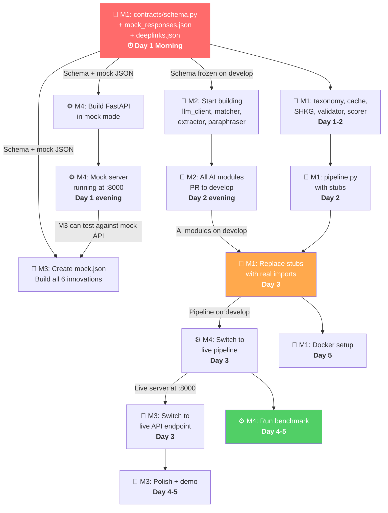

# 🗺️ Fixby — Complete Team Walkthrough & Integration Flow
### Samsung PRISM GenAI Hackathon · 5-Day Build Timeline
**Who should read this:** All 4 team members  
**Purpose:** This document shows **exactly how the whole team's work flows together** — what gets built when, who's blocked by whom, when to merge, and what to verify at each checkpoint.

---

## The Core Principle: Mock → Build → Integrate → Polish

```
Day 1-2: Everyone builds INDEPENDENTLY against mock data / stubs
Day 3:   INTEGRATION DAY — connect the real modules
Day 4:   Polish, edge cases, demo prep
Day 5:   Benchmark, Docker, tag, submit
```

Nobody should be waiting for anyone on Days 1-2 (except the Day 1 morning contract freeze from Member 1).

> 💡 **ELI5 — How 4 People Build Together Without Merge Conflicts:**
> Imagine a crew building a custom sports car:
> - If all 4 mechanics crowd around the engine at the same time, they drop wrenches and shout at each other (Git merge conflicts!).
> - Instead, **Member 1 (Lead)** hands out the exact blueprint on Day 1 morning (`contracts/schema.py`).
> - Then, everyone goes to their own separate workbench:
>   - **Member 2 (AI/ML)** builds the engine cylinders using test fuel in their own shed.
>   - **Member 3 (Frontend)** designs the gorgeous car dashboard and steering wheel using dummy electricity.
>   - **Member 4 (Backend)** constructs the transmission and speedometer testing with dummy power.
>   - **Member 1 (Lead)** builds the car chassis and braking safety systems using stand-in test parts.
> - On **Day 3 (Integration Day)**, everyone brings their completed parts to the main garage. Because everyone followed the exact same blueprint dimensions, all 4 pieces snap together like precision Lego bricks in less than two hours!

---

## Dependency Map — Who Blocks Whom



---

## Complete Day-by-Day Team Flow

---

### 📅 DAY 1 — Contract Freeze & Independent Setup

#### ⏰ Morning (First 2 Hours) — **EVERYONE BLOCKED UNTIL THIS IS DONE**

| Time | Who | What | Commit |
|:---|:---|:---|:---|
| 9:00 | 👑 M1 | Write `contracts/schema.py` (Samsung-exact) | `feat(contracts): freeze Samsung-exact schema` |
| 9:30 | 👑 M1 | Generate `contracts/mock_responses.json` | (same commit) |
| 9:45 | 👑 M1 | Drop in `contracts/deeplinks.json` (~575 entries) | (same commit) |
| 10:00 | 👑 M1 | **PR to develop → MERGE → message team: "contracts/ is ready, pull now"** | — |

#### After Contract Freeze — Everyone Starts Building

| Time | Who | What | Independent? | Commit |
|:---|:---|:---|:---|:---|
| 10:15 | 🤖 M2 | Pull develop. Set up `.env` with API keys. | ✅ | — |
| 10:30 | 🤖 M2 | Build `llm_client.py` (test with a basic prompt) | ✅ | `feat(ai): resilient LLM client with timeouts` |
| 10:30 | 🎨 M3 | Pull develop. Create `assets/mock.json` from schema | ✅ | `feat(frontend): mock data fixture` |
| 10:30 | ⚙️ M4 | Pull develop. Build `telemetry.py` | ✅ | `feat(backend): telemetry collector` |
| 11:00 | 👑 M1 | Build `taxonomy.py` (12 symptoms, 5 domains) | ✅ | `feat(core): symptom taxonomy` |
| 11:00 | ⚙️ M4 | Build `main.py` in **mock mode** | ✅ | `feat(backend): FastAPI mock mode` |
| 12:00 | 🤖 M2 | Build `matcher.py` (loads deeplinks.json) | ✅ | `feat(ai): deeplink catalog retriever` |
| 12:00 | 🎨 M3 | Build `index.html` + `style.css` (One UI dark theme) | ✅ | `feat(frontend): SPA shell + One UI theme` |

**End of Day 1 Checkpoint:**

| Who | Has Committed | Others Can Use It? |
|:---|:---|:---|
| 👑 M1 | `contracts/`, `taxonomy.py` | ✅ On develop — everyone has it |
| 🤖 M2 | `llm_client.py`, `matcher.py` | ❌ On feature branch — not needed yet |
| 🎨 M3 | `index.html`, `style.css`, `mock.json` | ❌ On feature branch — not needed yet |
| ⚙️ M4 | `telemetry.py`, `main.py` (mock) | ⚡ **Tell M3: "Mock server is at localhost:8000"** |

---

### 📅 DAY 2 — Full Independent Build

**Everyone is building independently today.** No integration, no blocking, no waiting.

| Who | What They're Building | All Independent? |
|:---|:---|:---|
| 👑 M1 | `cache.py`, `settings_graph.py`, `validator.py`, `scorer.py`, `pipeline.py` (with stubs) | ✅ All standalone — stubs replace M2's code |
| 🤖 M2 | `extractor.py`, `paraphraser.py`, `translator.py`, `graph_generator.py`, unit tests | ✅ All standalone — uses own `llm_client.py` + `matcher.py` |
| 🎨 M3 | ALL 6 innovation JS files: `oneui_sim`, `dag_viewer`, `hud_inspector`, `qr_bridge`, `voice`, `baseline_compare` | ✅ All against mock data |
| ⚙️ M4 | `benchmark.py` skeleton, endpoint tests | ✅ Against mock mode |

#### Detailed Day 2 Commit Schedule

**👑 Member 1:**
```
feat(core): 3-tier cascading cache with real embeddings
feat(core): SHKG with multi-strategy classes parser
feat(core): auto-repair validator with goal template enforcement
feat(core): compositional confidence scorer
feat(core): pipeline orchestrator with stubs (swap Day 3)
→ Open PR to develop
```

**🤖 Member 2:**
```
feat(ai): retrieval-bound schema extractor
feat(ai): register-diverse query paraphraser
feat(ai): Hinglish token-set canonicalizer
feat(ai): diagnostic DAG flowchart builder
test(ai): unit tests for all AI modules
→ Open PR to develop
```

**🎨 Member 3:**
```
feat(frontend): app controller with configurable API
feat(frontend): Three.js 3D Galaxy model
feat(frontend): One UI settings simulator
feat(frontend): interactive diagnostic DAG viewer
feat(frontend): real-time engine HUD
feat(frontend): QR code bridge
feat(frontend): bilingual voice assistant
feat(frontend): split-screen baseline comparison
→ Open PR to develop
```

**⚙️ Member 4:**
```
feat(backend): self-auditing benchmark suite
test(backend): endpoint and telemetry tests
→ Open PR to develop
```

**End of Day 2 Checkpoint:**

| Who | What's on develop (merged) |
|:---|:---|
| 👑 M1 | `contracts/`, `src/core/` (pipeline has stubs) |
| 🤖 M2 | `src/ai/` (all modules) |
| 🎨 M3 | `src/frontend/` (all UI, using mock data) |
| ⚙️ M4 | `src/backend/` (mock mode) |

> **⚠️ All PRs should be merged to develop by end of Day 2.** Day 3 needs everyone's code on the same branch.

---

### 📅 DAY 3 — INTEGRATION DAY ⚡

This is the critical day. Three integration swaps happen in sequence:

#### Step 1: Member 1 replaces stubs with Member 2's real modules (Morning)

```bash
# Member 1:
git fetch origin develop && git merge origin/develop

# In pipeline.py, replace stubs:
# FROM: _stub_get_candidate_ids()  →  TO: matcher.get_candidate_ids()
# FROM: _stub_extract()            →  TO: extract_structured_plan()
# FROM: _stub_paraphrase()         →  TO: generate_query_variations()
# ADD:  settings_graph.build_from_catalog(matcher.catalog)

# Test:
python -c "from src.core.pipeline import run_troubleshoot_pipeline; \
           r = run_troubleshoot_pipeline('battery drain'); \
           print(f'Source: {r.meta.pipeline_source}, Actions: {r.response.contexts[0].actions[0].actionName}')"
# MUST show: Source: live   (not "mock")
```

```
git commit -m "feat(core): pipeline wired to real AI modules — stubs removed"
→ PR to develop → MERGE
```

#### Step 2: Member 4 switches from mock mode to live pipeline (Midday)

```bash
# Member 4:
git fetch origin develop && git merge origin/develop

# In main.py, replace mock block:
# FROM: json.load("mock_responses.json")  →  TO: run_troubleshoot_pipeline(request.query, ...)
```

```
git commit -m "feat(backend): switch to live pipeline — mock mode removed"
→ PR to develop → MERGE
```

**Verify together:**
```bash
uvicorn src.backend.main:app --reload --port 8000
curl -X POST http://localhost:8000/v1/troubleshoot \
  -H "Content-Type: application/json" \
  -d '{"query": "battery draining fast"}'
# Check: pipeline_source="live", real actionName values, real deeplinks
```

#### Step 3: Member 3 switches from mock.json to live API (Afternoon)

```bash
# Member 3:
# In app.js, change data source:
# FROM: fetch("assets/mock.json")
# TO:   fetch(BACKEND_URL, {method:"POST", headers:{"Content-Type":"application/json"}, body:JSON.stringify({query})})
```

**Verify together:**
1. Open `http://localhost:3000`
2. Type: "battery draining fast"
3. Check ALL 6 innovations render with real data:
   - ✅ One UI simulator shows real navigation path
   - ✅ DAG shows real action nodes
   - ✅ HUD shows "LIVE" badge (not "MOCK")
   - ✅ QR code generates from real deeplink
   - ✅ Baseline comparison shows real engine output
   - ✅ Voice input → API → UI works end-to-end

```
git commit -m "feat(frontend): switch to live backend API"
→ PR to develop → MERGE
```

---

### 📅 DAY 4 — Polish & Edge Cases

**No new features. Fix what's broken, polish what works.**

| Who | Focus |
|:---|:---|
| 👑 M1 | Red-team fallback tests. SHKG leaf resolution visible in responses. Edge cases in validator. |
| 🤖 M2 | Fix any extractor failures from Day 3 testing. Verify Hinglish demo line works. Help M4 debug benchmark. |
| 🎨 M3 | Polish animations. DAG with real data. Baseline comparison with live output. Voice → API flow. Mobile responsive. |
| ⚙️ M4 | Run benchmark against live pipeline. Fix issues found. Get `metrics.md` to show clean results. |

**Verification Tests to Run:**
```bash
# Red-team fallback tests (Member 1)
pytest tests/test_core/test_fallback.py -v

# AI module tests (Member 2)
pytest tests/test_ai/ -v

# Backend + benchmark (Member 4)
python -m src.backend.benchmark
cat metrics.md  # Review results

# Demo queries (Everyone, together)
# Query 1 (Hinglish): "bhai mera phone bohot garam ho raha hai aur battery bhi jaldi khatam ho jaati hai"
# Query 2 (Camera):   "my Galaxy S24 camera keeps crashing when I try to take photos"
```

---

### 📅 DAY 5 — Benchmark, Docker, Tag, Submit

| Time | Who | What |
|:---|:---|:---|
| Morning | ⚙️ M4 | Run FINAL benchmark → commit `metrics.md` + `results.jsonl` |
| Morning | 👑 M1 | Docker compose tested: `docker compose up --build` |
| Midday | 🎨 M3 | Demo dry-run: full 5-minute presentation |
| Afternoon | 👑 M1 | All PRs merged to `main`. Tag: `PRISM_GENAI_HACKATHON_Y2026` |

**Pre-Submission Checklist (run through together):**

- [ ] `contracts/schema.py` matches Samsung Appendix A/B exactly
- [ ] Real `contracts/deeplinks.json` loaded (not dev fixture)
- [ ] `pipeline_source` shows "live" for real queries
- [ ] `metrics.md` shows 0 URL leaks, 0 safety violations, ~0 mock fallbacks
- [ ] `docker compose up` serves both engine (8000) and frontend (3000)
- [ ] `.env` is NOT in git history
- [ ] Demo queries work end-to-end with all 6 innovations rendering
- [ ] QR codes scannable on physical Galaxy phone (if available)

---

## Quick Reference: What Does Each Member Own?

```
contracts/           → 👑 Member 1: Nishant (schema, mocks, deeplinks)
src/core/            → 👑 Member 1: Nishant (pipeline, cache, SHKG, validator, taxonomy, scorer)
src/ai/              → 🤖 Member 2: G. Vishal (LLM client, extractor, matcher, translator, paraphraser, DAG)
src/frontend/        → 🎨 Member 3: Nidhi Nayana (all HTML/CSS/JS, all 6 visible innovations)
src/backend/         → ⚙️ Member 4: Rangesh (FastAPI, telemetry, benchmark)
docker/              → 👑 Member 1: Nishant (Dockerfile, compose, nginx)
tests/test_core/     → 👑 Member 1: Nishant
tests/test_ai/       → 🤖 Member 2: G. Vishal
tests/test_frontend/ → 🎨 Member 3: Nidhi Nayana
tests/test_backend/  → ⚙️ Member 4: Rangesh
```

**Rule:** Never push directly to `main` or `develop`. Always use feature branches and PRs.

---

## Emergency Contacts During Build

| Situation | Who to Call |
|:---|:---|
| "Schema field names look wrong" | 👑 **Nishant** (Lead Architect) |
| "LLM is returning garbage / timing out" | 🤖 **G. Vishal** (AI/ML Engineer) |
| "API response structure doesn't match what I expected" | ⚙️ **Rangesh** (Backend) + 👑 **Nishant** (Pipeline) |
| "UI renders 'undefined' for action names" | 🎨 **Nidhi Nayana** (Frontend) + 👑 **Nishant** (Schema) |
| "Benchmark shows mock fallbacks" | 🤖 **G. Vishal** (Extractor) + ⚙️ **Rangesh** (Benchmark) |
| "Docker won't build" | 👑 **Nishant** (Docker Owner) |
