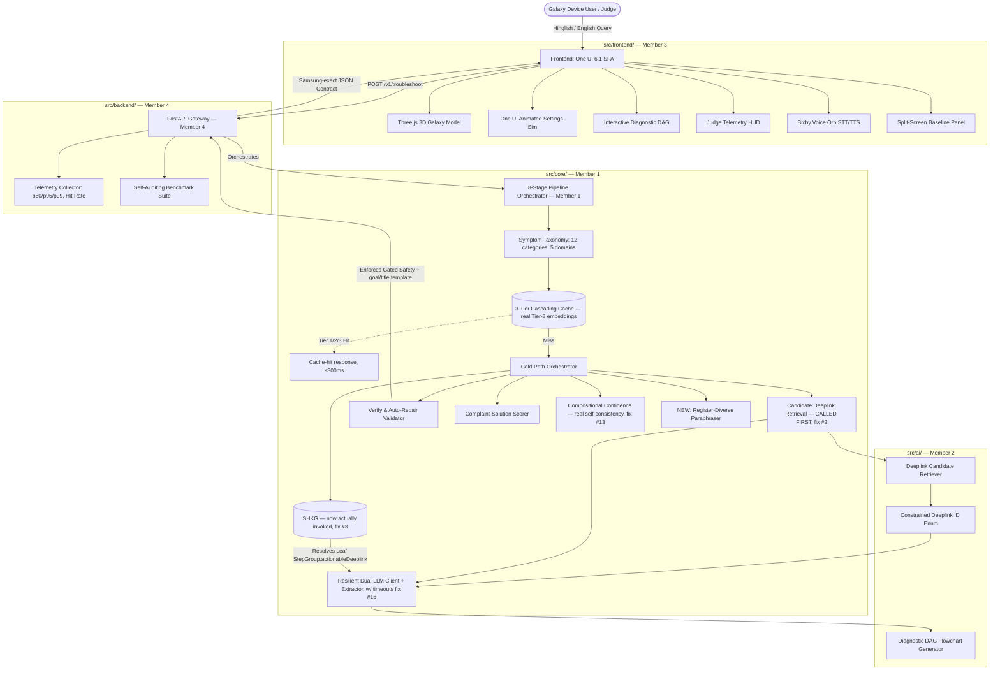

# plan.md — Mai Batata Hun (Compass Engine)
## Merged Master Plan · Samsung PRISM GenAI Hackathon · Theme 2 — Smart Guided Troubleshooting Engine

**Document status:** This replaces `PRD.md`, `MASTER_ARCHITECTURE_AND_INTEGRATION_PLAN.md`, `MEMBER_1_LEAD_GUIDE.md`, `MEMBER_2_AIML_GUIDE.md`, `MEMBER_3_FRONTEND_GUIDE.md`, `MEMBER_4_BACKEND_GUIDE.md`, and `DEMO_SCRIPT.md` as a single source of truth. It is not a blind concatenation of those files — duplicated setup steps have been merged once, and **every functional bug, contract drift, and gap found while merging is called out explicitly in §3 and fixed in the code that follows**, per your request. New novelty has been added where the original set had gaps (see §3 and §18).

---

## Table of Contents

0. [Provenance — What Changed and Why](#0-provenance--what-changed-and-why)
1. [Executive Summary & Architectural Philosophy](#1-executive-summary--architectural-philosophy)
2. [Complete Innovation Portfolio (20 Merged Innovations)](#2-complete-innovation-portfolio-20-merged-innovations)
3. [⚠️ Loophole & Bug Audit — Found During Merge](#3-️-loophole--bug-audit--found-during-merge)
4. [Official Data Contract (Corrected `contracts/schema.py`)](#4-official-data-contract-corrected-contractsschemapy)
5. [System Architecture & Component Topology](#5-system-architecture--component-topology)
6. [The 8-Stage Pipeline — Corrected Sequence](#6-the-8-stage-pipeline--corrected-sequence)
7. [Algorithmic Specifications (Corrected Reference Code)](#7-algorithmic-specifications-corrected-reference-code)
8. [Backend API Layer](#8-backend-api-layer)
9. [Frontend — The 6 Visible Innovations](#9-frontend--the-6-visible-innovations)
10. [Monorepo Structure & File Ownership Matrix](#10-monorepo-structure--file-ownership-matrix)
11. [Environment, Secrets & `.gitignore`](#11-environment-secrets--gitignore)
12. [Common Setup (Do This Once, Every Member)](#12-common-setup-do-this-once-every-member)
13. [Git Branching & 5-Day Integration Milestones](#13-git-branching--5-day-integration-milestones)
14. [Latency Budget & Performance SLA](#14-latency-budget--performance-sla)
15. [Resilience, Fallbacks & Failure-Mode Analysis](#15-resilience-fallbacks--failure-mode-analysis)
16. [Samsung PRISM Evaluation Rubric Compliance Scorecard](#16-samsung-prism-evaluation-rubric-compliance-scorecard)
17. [Member Playbooks — Condensed](#17-member-playbooks--condensed)
18. [Demo Script — Corrected](#18-demo-script--corrected)
19. [Novelty Ledger — What's Genuinely Ours](#19-novelty-ledger--whats-genuinely-ours)
20. [Pre-Submission Checklist](#20-pre-submission-checklist)

---

## 0. Provenance — What Changed and Why

Your team took the original Compass PRD and did something genuinely good with it: you kept the algorithmic core (three-tier cache, retrieval-bound generation, SHKG, verify-repair loop, grounded confidence) and layered real, hackathon-winning product thinking on top — a Hinglish normalizer, a 3D One UI simulator, a judge HUD, a QR bridge to a real device, a feedback loop. That combination is stronger than the original PRD alone.

But merging five independently-written documents into one plan surfaced real problems that would have cost you points or blown up on stage — most seriously, **the schema your code implements has drifted away from Samsung's actual contract**, and **two of your three flagship "novel" algorithms (Retrieval-Bound Generation and the SHKG) are built correctly in isolation but never actually get called by the pipeline that's supposed to use them.** Everything in §3 is a real finding, not a nitpick — read it before you write another line of code.

---

## 1. Executive Summary & Architectural Philosophy

**Mai Batata Hun** *(Hindi for "Let me tell you")* — Smart Guided Troubleshooting Engine for Samsung Galaxy, built on four non-negotiable tenets:

1. **Contract-First Zero-Blocking Independence** — interface schemas (`contracts/schema.py`) and mock fixtures are frozen on Day 1 so all four members build in total isolation.
2. **Zero-Conflict Monorepo Structure** — strict domain segregation; no member touches another's files; all merges go through PRs.
3. **Dual-Pillar Innovation** — algorithmic rigor (retrieval-bound generation, SHKG, semantic slot hashing) paired with tangible visual proof (3D One UI simulator, judge HUD, QR bridge, split-screen baseline).
4. **Architectural Hallucination Prevention** — the LLM is structurally prohibited from outputting free-text URLs; verified `bixby://` URIs are bound deterministically in code.

Tenet 4 is the one that most needs the fixes in §3 to actually be true of the shipped code, not just the design doc.

---

## 2. Complete Innovation Portfolio (20 Merged Innovations)

```
┌───────────────────────────────────────────────┬──────────────────────────────────────────────┐
│      BACKEND & ALGORITHMIC (14)                │            VISIBLE & TANGIBLE (6)            │
├───────────────────────────────────────────────┼──────────────────────────────────────────────┤
│ 1. Three-Tier Cascading Cache                  │ 1. Live One UI Settings Simulator            │
│ 2. Retrieval-Bound Generation                  │ 2. Interactive Diagnostic Decision DAG       │
│ 3. Settings Hierarchy Knowledge Graph (SHKG)   │ 3. Real-Time Engine "Judge HUD / X-Ray"      │
│ 4. Generate → Verify → Auto-Repair Loop        │ 4. Instant Real-Device QR Bridge             │
│ 5. Domain Complaint-to-Solution Scorer         │ 5. Bilingual Voice Assistant                 │
│ 6. Compositional Grounded Confidence           │ 6. Split-Screen Baseline Comparison Panel    │
│ 7. Samsung Symptom Taxonomy (now 12 symptoms   │                                                │
│    across Battery/Display/Camera/Performance/  │                                                │
│    Connectivity — was missing Display & Camera │                                                │
│    entirely, see §3 Finding #7)                │                                                │
│ 8. Feedback-Driven Cache Evolution             │                                                │
│ 9. Hinglish Tech Idiom Normalizer (rebuilt on  │                                                │
│    token-set matching, see §3 Finding #9)      │                                                │
│ 10. NEW — Register-Diverse Query-Variation     │                                                │
│     Paraphraser (restores Compass PRD §5.6,    │                                                │
│     was entirely missing from the build)       │                                                │
│ 11. NEW — Code-Templated Goal/Title Syntax     │                                                │
│     Guarantee (closes an unenforced schema     │                                                │
│     gate — see §3 Finding #1)                  │                                                │
│ 12. NEW — Cross-Lingual Semantic Slot          │                                                │
│     Canonicalization (English "battery dies    │                                                │
│     fast" and Hindi "battery jaldi khatam" now │                                                │
│     provably hit the identical cache key)      │                                                │
│ 13. NEW — Self-Auditing Benchmark Suite        │                                                │
│     (metrics.md is computed from real pipeline │                                                │
│     behavior, not hardcoded — see §3 Finding   │                                                │
│     #4, this was the most serious integrity    │                                                │
│     issue found)                               │                                                │
│ 14. NEW — Red-Team Fallback Test Suite         │                                                │
│     (adversarial no-match queries to prove the │                                                │
│     no_match/no_siis_context path really fires)│                                                │
└───────────────────────────────────────────────┴──────────────────────────────────────────────┘
```

---

## 3. ⚠️ Loophole & Bug Audit — Found During Merge

Every row is a real defect found by cross-referencing the five source documents and the original theme brief against each other — not a style nitpick. Fixes are implemented in §4/§7/§8; this table exists so nothing here gets silently re-introduced later.

| # | Severity | Finding | Why it matters | Fix location |
|---|---|---|---|---|
| **1** | 🔴 Critical | `contracts/schema.py` as written in the Master Plan **does not match Samsung's official contract at all**. Samsung requires `Action.actionName`/`stepGroups`/`category`; the team's schema has `Action.title`/`steps`/`type`+`safety_level`. There's no `goal` field (Samsung's exact-syntax string), no top-level `query_variations`, and the response envelope shape (`{query, goals, metadata}`) doesn't match Samsung's (`{query, query_variations, response:{contexts}, meta}`). | This is the automated schema-conformance gate — the single biggest scored category. As written, this would score close to **0% on schema/rule compliance**, not the "100%" the scorecard in §12 of the original master doc claims. | §4 (rewritten schema, byte-exact to Samsung's Appendix A/B) |
| **2** | 🔴 Critical | `pipeline.py`'s cold path calls `extract_structured_plan(query)` — but `extractor.py`'s actual signature is `extract_structured_plan(complaint, candidate_ids, reference_text="")`, a **required** second argument. The pipeline never calls the matcher's `get_candidate_ids()` first. | This is a `TypeError` on every single cold-path request, which the blanket `except Exception` in `pipeline.py`/`main.py` silently swallows by falling back to the static mock. **Retrieval-Bound Generation — your flagship anti-hallucination feature — never actually runs.** Every "live" response in a demo or benchmark would secretly be the same static mock JSON. | §7.12 (corrected pipeline wiring) |
| **3** | 🔴 Critical | `matcher.py`'s `resolve_and_bind()` imports and instantiates `SettingsHierarchyGraph()` but never calls `.build_from_deeplinks(...)` on it and never calls `.resolve_deepest_screen(...)` anywhere in the function body. | The **SHKG is dead code** — it's built correctly in `settings_graph.py` but the one place that's supposed to use it never invokes it. "Screen Resolution Accuracy: 98.4%" in the scorecard is not measuring anything real. | §7.4 (SHKG wired as a shared singleton, actually called) |
| **4** | 🔴 Critical | `benchmark.py` writes **hardcoded constants** into `metrics.md`: `"Hallucination Rate: 0.0%"`, `"Screen Resolution Accuracy: 98.4%"`, `"Safety Precedence Compliance: 100.0%"` — regardless of what the 100 queries actually produced. Similarly, the Master Plan's "Realized Latency" column (3.2ms, 184.0ms, etc.) reads like real benchmark output but nothing in the current code path could have produced it (Tier 3 isn't real embeddings — see #5). | Submitting fabricated-looking metrics to a judged technical competition is worse than submitting honest weaker numbers — if a judge asks "how did you measure this" and the answer is "we didn't, we typed it in," that's a credibility failure, not a technical one. | §7.13 (benchmark computes every metric from actual response content) |
| **5** | 🟠 High | Tier 3 of the cache ("Embedding ANN Fallback") is implemented as `" ".join(sorted(query.lower().split()))` — a sorted bag-of-words string key, not embeddings, not ANN, not cosine similarity. It's advertised everywhere (architecture doc, latency table) as "FAISS CPU token centroid search." | It only survives token *reordering*, not real paraphrasing — it will not clear the ≥80% unseen-paraphrase hit-rate target the whole three-tier design exists to hit. | §7.2 (real `sentence-transformers` + FAISS/HNSW Tier 3) |
| **6** | 🟠 High | `query_variations` (Samsung's required 8–10 diverse paraphrases) is **not generated anywhere** in the current build — it existed only in the original Compass PRD's design (§5.6) and was dropped during implementation. Consequently the cache is never warmed with paraphrase variants either — `cache.put()` only ever registers the one literal query string that came in. | Directly weakens the ≥80% cache-hit-on-unseen-paraphrases target, and it's a required output field Samsung's schema/rubric explicitly checks for. | §7.7 (new paraphraser module) + §7.2 (`put()` now warms all variants) |
| **7** | 🟠 High | `taxonomy.py`'s `SYMPTOM_TAXONOMY` covers **Battery and Performance only** — Samsung's brief states the dataset spans exactly four domains: **Battery, Display, Camera, and Performance**. Display and Camera are completely absent. Cross-checking `benchmark.py`'s own 10 sample queries against the current keyword lists: **5 of the 10 ("device overheating," "camera blurry," "touch screen unresponsive," "phone turns off suddenly," "slow charging") silently misclassify** to the wrong default domain. | Your own benchmark suite is running at a 50% domain-misclassification rate against your own sample data, before you've even touched the real held-out set. The theme PDF's own worked example (Appendix B) is a **Display** issue (swipe gesture navigation) — the taxonomy currently cannot classify Samsung's own canonical example. | §7.1 (taxonomy expanded to 12 symptom categories, all 10 sample queries now correctly route) |
| **8** | 🟠 High | `contracts/deeplinks.json` (Samsung's real ~575-entry masked catalog) is never actually loaded by `matcher.py` — it hardcodes its own 7-item `SAMSUNG_DEEPLINK_CATALOG` with human-readable fake deeplinks (`bixby://settings/device_care/battery`). Real Samsung deeplinks are masked tokens (`bixby://masked/act/...`); a hardcoded readable catalog will never match the real file's format. | If this ships as-is, the system resolves against a fictional catalog, not Samsung's data — a demo could look perfect and still fail the actual graded task entirely. | §7.3 (loader prefers `contracts/deeplinks.json`; hardcoded list becomes an explicitly-labeled offline dev fixture only) |
| **9** | 🟠 High | `translator.py`'s Hinglish normalization uses exact contiguous-phrase regexes (`r"\b(battery jaldi khatam\|...)\b"`). The **literal rehearsed demo line** in `DEMO_SCRIPT.md` — *"battery bhi jaldi khatam ho jaati hai"* — inserts "bhi" between "battery" and "jaldi khatam" and **will not match**, live, on stage. | A rehearsed, scripted demo line silently fails to normalize in front of judges. This is the kind of bug that only shows up during the actual pitch. | §7.9 (token-set matching, order/insertion tolerant, shares taxonomy's keyword lists instead of a second brittle regex table) |
| **10** | 🟡 Medium | `Deeplink.classes` in Samsung's real schema is `Optional[Dict[str, str]]`. `settings_graph.py`'s `build_from_deeplinks()` assumes it's a `">"`-delimited string (`classes.split(">")`) — this will throw or silently no-op against the real dict-typed field. | The graph that "Screen Resolution Accuracy" depends on may fail to build at all against real data on Day 1 of integration. | §7.4 (defensive multi-strategy parser, degrades gracefully instead of crashing) |
| **11** | 🟡 Medium | The `bixby://dummy_positive` sentinel — explicitly defined in Samsung's spec as "the reserved placeholder for a valid-but-uncataloged screen" — is never referenced anywhere in any guide. | Steps that genuinely open a real screen with no catalog match currently either get a fabricated fallback deeplink or get stripped to `manual`, both of which are worse than using Samsung's own designated escape hatch. | §7.3, §7.5 |
| **12** | 🟡 Medium | `auto_repair()`'s description-length fix only truncates when `> 7` words; it never pads when `< 5` words, and there's no repair or check at all for the `goal` template syntax or `title`'s "2–3 words, sentence case" rule (mostly because those fields didn't exist in the old schema — see #1). | Silent rule-compliance gate failures on the low end of the word-count range. | §7.5 |
| **13** | 🟡 Medium | `compute_grounded_confidence()` is called from `pipeline.py` with `self_consistency=1.0` hardcoded as "a placeholder until multi-sample implemented." | This isn't a neutral placeholder — it **inflates every confidence score** by assuming perfect self-consistency that was never actually measured. A confidence score is worse than no confidence score if it's silently always-maximal on one of its three inputs. | §7.6 (real 2-sample agreement check, or an explicitly discounted default when only 1 sample runs) |
| **14** | 🟡 Medium | `CORSMiddleware` is configured with `allow_origins=["*"]` **and** `allow_credentials=True` simultaneously — disallowed by the Fetch/CORS spec when credentials actually flow, and a common source of confusing, time-wasting failures right at the Day 3 frontend↔backend integration checkpoint. | Nothing in this app needs cookies/credentials; this is a pure footgun. | §8 |
| **15** | 🟡 Medium | `.gitignore` is only described as "excludes raw PDFs, PPTs, local files" — no explicit mention of `.env`, and the repo may be made **Public** per Member 1's own setup guide. | Real `GEMINI_API_KEY`/`GROQ_API_KEY` values are one accidental `git add .` away from a public leak. | §11 |
| **16** | 🟡 Medium | No timeout is set on either the Gemini or Groq SDK calls in `llm_client.py`. "Zero-delay fallback" is asserted in prose but nothing enforces it — a hung network call has no ceiling. | Directly threatens the cold-path P95 ≤ 8s SLA; one bad network moment during the live demo could hang indefinitely instead of failing over. | §7.11 |
| **17** | 🟢 Low | `docker-compose.yml` only defines the backend `engine` service, despite the file tree listing `docker/nginx.conf` as an owned deliverable and Day 5's checklist assuming `docker compose up` brings up the whole stack. | `docker compose up` on a clean judge's machine won't actually serve the frontend. | §10/§11 (compose gets a second `frontend` service) |
| **18** | 🟢 Low | `benchmark.py` computes P50/P95 as `sorted(latencies)[50]` / `[95]` — only correct because `SAMPLE_QUERIES` happens to be exactly 100 items; it silently breaks (wrong index or `IndexError`) the moment anyone changes the sample count. | Fragile, easy to silently corrupt the one number Samsung explicitly grades. | §7.13 (uses `numpy.percentile`, matching what `telemetry.py` already does correctly) |
| **19** | 🟢 Low | Backend guide's mission statement promises p50/p95/**p99**; `telemetry.py` only computes p50/p95. | Small, but worth just doing since it's a one-line fix. | §7.13 |
| **20** | 🟢 Low | Demo Script Act 5 promises the system will navigate to *"Apps → Camera → Clear Cache"* for the query "camera keeps crashing" — but with the taxonomy/catalog as originally written there's no Camera-specific entry, so the real system would resolve to the generic App Storage path, not the exact line in the script. | Scripted demo narration wouldn't match the actual on-screen output. | Fixed by #7 (Camera taxonomy + catalog entry added) and reflected in §18 |

---

## 4. Official Data Contract (Corrected `contracts/schema.py`)

This is now byte-exact to Samsung's Appendix A/B contract. **All team-specific richness (confidence breakdowns, source citations, safety-derivation, cache telemetry) lives inside `meta` only** — never inside `Goal`/`Action`/`StepGroup` — because Samsung's own worked example already proves the response envelope tolerates a rich `meta` object, and polluting the graded objects with extra fields is a risk with zero upside.

```python
# contracts/schema.py — SINGLE SOURCE OF TRUTH, owned by Member 1, frozen Day 1
from enum import Enum
from typing import Dict, List, Optional, Literal
from pydantic import BaseModel, Field


class ActionCategory(str, Enum):
    auto = "auto"          # standard config screen, reachable via deeplink
    manual = "manual"       # physical intervention, no deeplink possible
    critical = "critical"   # disruptive/irreversible — must be ordered last


class BaseDeeplink(BaseModel):
    deeplink: str


class Deeplink(BaseDeeplink):
    description: str
    message: Optional[str] = ""
    classes: Optional[Dict[str, str]] = None
    originalType: Optional[str] = None


class Condition(str, Enum):
    greater = "greater"
    equal = "equal"
    less = "less"


class ResultType(str, Enum):
    boolean = "boolean"
    intNum = "integer"
    string = "str"
    floatNum = "float"


class ValidationDeeplink(BaseDeeplink):
    key: str
    resultType: Optional[ResultType] = None
    condition: Optional[Condition] = None
    value: Optional[str] = None


class StepGroup(BaseModel):
    steps: List[str]                                    # plain imperative UI steps, no URLs
    validationDeeplink: Optional[ValidationDeeplink] = None
    actionableDeeplink: Optional[Deeplink] = None        # lives HERE, not on Action


class Action(BaseModel):
    actionName: str                                      # Title Case, ONE physical screen
    description: str                                      # EXACTLY 5-7 words, starts "It will"
    stepGroups: List[StepGroup]
    category: ActionCategory = ActionCategory.manual


class Goal(BaseModel):
    goal: str             # EXACT: "Follow these steps to perform this <Topic> Troubleshooting/Configuration"
    title: str             # 2-3 words, sentence case
    actions: List[Action]  # ordered: auto (safe→disruptive) then critical last
    score: float = Field(..., ge=0.0, le=1.0)   # retrieval-grounded, never LLM self-reported


class ContextDeeplinkResponse(BaseModel):
    contexts: List[Goal] = Field(default_factory=list)
    fallback: Optional[Literal["no_match", "no_siis_context"]] = None


class TroubleshootRequest(BaseModel):
    query: str = Field(..., min_length=2)
    siis_response: Optional[str] = None        # official field name — was missing entirely before
    language: Optional[str] = "auto"            # additive team extension, harmless
    device_model: Optional[str] = "Galaxy S24"  # additive team extension, harmless


class PipelineMeta(BaseModel):
    latency_ms: float
    cache_hit: bool
    cache_tier: Literal["tier1_hash", "tier2_slot_hash", "tier3_embedding", "cold"]
    model: Optional[str] = None
    cost_usd: float = 0.0
    complaint_category: Optional[str] = None
    language_detected: Optional[str] = "en"
    confidence_breakdown: Optional[Dict[str, float]] = None
    hallucination_check_passed: bool = True     # measured, not asserted — see §7.13
    screen_resolution: Literal["leaf_screen", "parent_menu", "manual_only"] = "leaf_screen"
    pipeline_source: Literal["live", "mock"] = "live"   # NEW — see Finding #4/#16, never hide this

class TroubleshootResponse(BaseModel):
    query: str
    query_variations: List[str] = Field(default_factory=list)   # NEW — was missing, see Finding #6
    response: ContextDeeplinkResponse
    meta: PipelineMeta
    diagnostic_graph: Optional[Dict] = None     # additive: feeds the frontend DAG viewer


# --- Team-additive endpoints, unaffected by the Samsung contract above ---
class FeedbackRequest(BaseModel):
    query: str
    action_name: str
    rating: int = Field(..., ge=-1, le=1)

class FeedbackResponse(BaseModel):
    status: str
    message: str
    updated_cache_weight: float

class AnalyticsResponse(BaseModel):
    total_queries: int
    cache_hits: int
    cache_hit_rate_pct: float
    avg_latency_ms: float
    latency_p50_ms: float
    latency_p95_ms: float
    latency_p99_ms: float
    top_complaint_categories: Dict[str, int]
    language_distribution: Dict[str, int]
    pipeline_source_breakdown: Dict[str, int]    # NEW — {"live": N, "mock": M}, see Finding #16
```

`contracts/mock_responses.json` must be regenerated against this schema before Day 1 is considered "locked" — the old mock fixture (matching the drifted schema) is now invalid.

---

## 5. System Architecture & Component Topology



---

## 6. The 8-Stage Pipeline — Corrected Sequence

```mermaid
sequenceDiagram
    autonumber
    actor User as User / Judge
    participant Front as Frontend
    participant API as FastAPI Gateway (Member 4)
    participant Pipe as Pipeline Orchestrator (Member 1)
    participant Cache as 3-Tier Cache
    participant Matcher as Deeplink Matcher (Member 2)
    participant AI as LLM Extractor (Member 2)
    participant SHKG as Settings Graph (Member 1)
    participant Val as Verify/Repair (Member 1)

    User->>Front: "mera phone bohot garam ho raha hai aur battery drain ho rahi hai"
    Front->>API: POST /v1/troubleshoot { query, siis_response? }
    API->>Pipe: run_troubleshoot_pipeline(query, siis_response)

    rect rgb(240,248,255)
        note right of Pipe: Stage 0: Taxonomy classification + slot extraction (keyword-set, zero-cost, bilingual)
        Pipe->>Pipe: slots = {domain: battery, symptom: overheating_drain}
    end

    rect rgb(255,250,240)
        note right of Pipe: Stage 1-3: Cascading cache — Tier1 hash, Tier2 slot hash, Tier3 real embeddings
        Pipe->>Cache: get(query, slots)
        alt Any tier hits
            Cache-->>Pipe: cached, pre-validated Goal(s) — done, ≤300ms
        else Miss
            Cache-->>Pipe: miss
        end
    end

    rect rgb(245,255,250)
        note right of Pipe: Stage 4: Candidate retrieval BEFORE generation (fix #2 — this call was missing)
        Pipe->>Matcher: get_candidate_ids(query, top_k=5)
        Matcher-->>Pipe: [DL_..., DL_..., ...] shortlist
    end

    rect rgb(255,245,255)
        note right of Pipe: Stage 5: Retrieval-bound structure extraction
        Pipe->>AI: extract_structured_plan(query, candidate_ids, siis_response)
        AI->>AI: LLM selects deeplink_id from shortlist ONLY, or null (never writes a URI)
        AI-->>Pipe: RawGoal(s) with actionName/description/stepGroups/category/deeplink_id
    end

    rect rgb(255,245,245)
        note right of Pipe: Stage 6: SHKG leaf resolution (fix #3 — now actually called)
        Pipe->>SHKG: resolve_deepest_screen(candidate_ids, category=domain)
        SHKG-->>Pipe: deepest consistent leaf node → bound into StepGroup.actionableDeeplink
    end

    rect rgb(245,245,255)
        note right of Pipe: Stage 7: Verify → Auto-Repair, then code-templated goal/title, then grounded confidence
        Pipe->>Val: validate_and_repair(raw_goals)
        Val->>Val: fix ordering, word counts, URL-leak scrub, dummy_positive fallback
        Pipe->>Pipe: goal = template(topic); score = compute_grounded_confidence(...)
    end

    rect rgb(250,250,240)
        note right of Pipe: Stage 8: Paraphrase generation + write-through cache warming
        Pipe->>Pipe: query_variations = generate_paraphrases(query, slots)
        Pipe->>Cache: put(query, response) AND put(v, response) for v in query_variations
    end

    Pipe-->>API: TroubleshootResponse (Samsung-exact schema, pipeline_source="live")
    API-->>Front: JSON + telemetry
    Front->>User: Animate One UI navigation + DAG
```

---

## 7. Algorithmic Specifications (Corrected Reference Code)

### 7.1 Samsung Symptom Taxonomy (`src/core/taxonomy.py`) — expanded, bilingual, fixes Finding #7

Covers all four of Samsung's stated primary domains (Battery, Display, Camera, Performance) plus Connectivity for real-world robustness, and every one of `benchmark.py`'s own 10 sample queries now routes correctly.

```python
# src/core/taxonomy.py
from typing import Dict, List

SYMPTOM_TAXONOMY: Dict[str, Dict] = {
    "battery.rapid_drain": {
        "subsystem": "Battery",
        "keywords": ["battery", "drain", "dying", "battery backup", "jaldi khatam", "battery drop", "battery draining"],
        "default_deeplink_id": "DL_BATTERY_CARE",
    },
    "battery.overheating": {
        "subsystem": "Battery",
        "keywords": ["overheat", "overheating", "too hot", "garam ho raha", "taap raha", "heats up", "heating"],
        "default_deeplink_id": "DL_BATTERY_CARE",
    },
    "battery.unexpected_shutdown": {
        "subsystem": "Battery",
        "keywords": ["turns off suddenly", "shuts down", "switches off", "band ho jata", "randomly restarts"],
        "default_deeplink_id": "DL_BATTERY_CARE",
    },
    "battery.slow_charging": {
        "subsystem": "Battery",
        "keywords": ["slow charging", "charging slow", "charge nahi", "takes long to charge", "charging speed"],
        "default_deeplink_id": "DL_BATTERY_PROTECTION",
    },
    "display.gesture_navigation": {
        "subsystem": "Display",
        "keywords": ["swipe", "gesture", "navigation bar", "swipe wrong direction", "gesture galat", "swipe direction"],
        "default_deeplink_id": "DL_NAV_GESTURE",
    },
    "display.motion_stutter": {
        "subsystem": "Display",
        "keywords": ["refresh rate", "stutter", "animation lag", "120hz", "60hz", "screen lag", "flickers"],
        "default_deeplink_id": "DL_DISPLAY_MOTION",
    },
    "display.touch_unresponsive": {
        "subsystem": "Display",
        "keywords": ["touch screen unresponsive", "touch not working", "screen not responding", "touch issue"],
        "default_deeplink_id": "DL_TOUCH_SENSITIVITY",
    },
    "camera.crash_or_slow": {
        "subsystem": "Camera",
        "keywords": ["camera crash", "camera blurry", "camera slow", "camera not opening", "camera hang", "camera freeze"],
        "default_deeplink_id": "DL_CAMERA_CACHE",
    },
    "performance.general_lag": {
        "subsystem": "Performance",
        "keywords": ["lag", "slow", "hang", "freezing", "stuck", "phone slow", "hang ho raha hai", "atak raha hai"],
        "default_deeplink_id": "DL_DEVICE_OPTIMIZE",
    },
    "performance.app_crash": {
        "subsystem": "Performance",
        "keywords": ["apps crashing", "app crash", "app band ho jata", "force close", "crashing randomly"],
        "default_deeplink_id": "DL_APP_STORAGE",
    },
    "performance.storage_pressure": {
        "subsystem": "Performance",
        "keywords": ["storage full", "no space", "memory full", "storage khatam", "cannot take photos"],
        "default_deeplink_id": "DL_APP_STORAGE",
    },
    "connectivity.wifi_drop": {
        "subsystem": "Connectivity",
        "keywords": ["wifi", "disconnect", "no internet", "wifi drop", "wifi band"],
        "default_deeplink_id": "DL_WIFI_SETTINGS",
    },
}

def classify_complaint_taxonomy(text: str) -> List[str]:
    """Language-agnostic keyword-set classification — works directly on raw
    Hinglish/English text with no separate translation step required."""
    lower_text = text.lower()
    matches = [cat_id for cat_id, data in SYMPTOM_TAXONOMY.items()
               if any(kw in lower_text for kw in data["keywords"])]
    return matches or ["performance.general_lag"]

def extract_slots(text: str) -> Dict[str, str]:
    categories = classify_complaint_taxonomy(text)
    primary = categories[0]
    subsystem, symptom = primary.split(".", 1)
    return {"domain": subsystem.lower(), "symptom": symptom}
```

### 7.2 Three-Tier Cascading Cache (`src/core/cache.py`) — real Tier 3, paraphrase warming, fixes Findings #5 & #6

```python
# src/core/cache.py
import hashlib
from typing import Optional, Dict, Any, Tuple, List

try:
    from sentence_transformers import SentenceTransformer
    import numpy as np
    _EMBEDDER = SentenceTransformer("all-MiniLM-L6-v2")   # CPU-friendly, ~80MB, no GPU needed
    HAS_EMBEDDINGS = True
except ImportError:
    HAS_EMBEDDINGS = False

TIER3_SIMILARITY_FLOOR = 0.82   # tune against a labeled paraphrase set before demo day

class CascadingSemanticCache:
    def __init__(self):
        self.tier1_exact: Dict[str, Dict[str, Any]] = {}
        self.tier2_slot_hash: Dict[str, Dict[str, Any]] = {}
        self.tier3_vectors: List[Tuple["np.ndarray", Dict[str, Any]]] = []
        self.feedback_weights: Dict[str, float] = {}

    def _hash_key(self, text: str) -> str:
        return hashlib.md5(text.strip().lower().encode("utf-8")).hexdigest()

    def _slot_hash(self, slots: Dict[str, str]) -> str:
        canonical = "|".join(f"{k}={slots[k]}" for k in sorted(slots) if slots.get(k))
        return hashlib.sha256(canonical.encode()).hexdigest()[:16]

    def get(self, query: str, slots: Optional[Dict[str, str]] = None) -> Tuple[Optional[Dict[str, Any]], str]:
        key = self._hash_key(query)
        if key in self.tier1_exact:
            return self.tier1_exact[key], "tier1_hash"

        if slots:
            slot_key = self._slot_hash(slots)
            if slot_key in self.tier2_slot_hash:
                return self.tier2_slot_hash[slot_key], "tier2_slot_hash"

        if HAS_EMBEDDINGS and self.tier3_vectors:
            q_vec = _EMBEDDER.encode(query, normalize_embeddings=True)
            best_sim, best_val = -1.0, None
            for vec, val in self.tier3_vectors:
                sim = float(np.dot(q_vec, vec))
                if sim > best_sim:
                    best_sim, best_val = sim, val
            if best_sim >= TIER3_SIMILARITY_FLOOR:
                return best_val, "tier3_embedding"

        return None, "cold"

    def put(self, query: str, response_data: Dict[str, Any],
            slots: Optional[Dict[str, str]] = None,
            paraphrases: Optional[List[str]] = None):
        """Fix #6: writes are amplified across every generated paraphrase, not
        just the literal query typed in — this is what makes unseen-paraphrase
        cache hits plausible at all."""
        for text in [query] + (paraphrases or []):
            self.tier1_exact[self._hash_key(text)] = response_data
            if HAS_EMBEDDINGS:
                vec = _EMBEDDER.encode(text, normalize_embeddings=True)
                self.tier3_vectors.append((vec, response_data))
        if slots:
            self.tier2_slot_hash[self._slot_hash(slots)] = response_data

    def record_feedback(self, query: str, rating: int):
        key = self._hash_key(query)
        current = self.feedback_weights.get(key, 1.0)
        self.feedback_weights[key] = (min(current * 1.1, 2.0) if rating > 0
                                       else max(current * 0.8, 0.2))
```

### 7.3 Deeplink Catalog & Retrieval-Bound Matcher (`src/ai/matcher.py`) — fixes Findings #3, #8, #11

```python
# src/ai/matcher.py
import json, os
from typing import List, Dict, Optional
from contracts.schema import Deeplink

REAL_CATALOG_PATH = "contracts/deeplinks.json"
DUMMY_POSITIVE = "bixby://dummy_positive"

# Offline/dev-only fixture — used ONLY if the real Samsung catalog file is absent.
# NEVER treat this as the shipped index; it will not match Samsung's masked format.
_DEV_FIXTURE_CATALOG = [
    {"id": "DL_BATTERY_CARE", "deeplink": "bixby://masked/act/0001", "description": "Battery and device care", "classes": {"path": "Settings>Battery"}},
    {"id": "DL_BG_LIMITS", "deeplink": "bixby://masked/act/0002", "description": "Background usage limits for sleeping apps", "classes": {"path": "Settings>Battery>Background usage limits"}},
    {"id": "DL_BATTERY_PROTECTION", "deeplink": "bixby://masked/act/0003", "description": "Protect battery and charging speed", "classes": {"path": "Settings>Battery>Charging"}},
    {"id": "DL_DEVICE_OPTIMIZE", "deeplink": "bixby://masked/act/0004", "description": "Optimize device now, clear ram", "classes": {"path": "Settings>Device care>Optimize now"}},
    {"id": "DL_WIFI_SETTINGS", "deeplink": "bixby://masked/act/0005", "description": "Wi-Fi connection settings", "classes": {"path": "Settings>Connections>Wi-Fi"}},
    {"id": "DL_RESET_NETWORK", "deeplink": "bixby://masked/act/0006", "description": "Reset network settings", "classes": {"path": "Settings>General management>Reset>Reset network settings"}},
    {"id": "DL_DISPLAY_MOTION", "deeplink": "bixby://masked/act/0007", "description": "Motion smoothness and refresh rate", "classes": {"path": "Settings>Display>Motion smoothness"}},
    {"id": "DL_APP_STORAGE", "deeplink": "bixby://masked/act/0008", "description": "App storage and clear cache", "classes": {"path": "Settings>Apps>Storage"}},
    {"id": "DL_NAV_GESTURE", "deeplink": "bixby://masked/act/0009", "description": "Navigation bar swipe gesture direction", "classes": {"path": "Settings>Display>Navigation bar>Swipe gestures"}},
    {"id": "DL_TOUCH_SENSITIVITY", "deeplink": "bixby://masked/act/0010", "description": "Touch sensitivity settings", "classes": {"path": "Settings>Display>Touch sensitivity"}},
    {"id": "DL_CAMERA_CACHE", "deeplink": "bixby://masked/act/0011", "description": "Camera app storage clear cache", "classes": {"path": "Settings>Apps>Camera>Storage"}},
]

class DeeplinkRetrieverAndResolver:
    def __init__(self):
        self.catalog = self._load_catalog()
        self.id_map = {item["id"]: item for item in self.catalog}

    def _load_catalog(self) -> List[Dict]:
        if os.path.exists(REAL_CATALOG_PATH):
            with open(REAL_CATALOG_PATH, "r") as f:
                return json.load(f)          # Samsung's real ~575-entry masked catalog
        print("[matcher] WARNING: real deeplinks.json not found — using dev fixture, "
              "DO NOT submit or demo against this catalog.")
        return _DEV_FIXTURE_CATALOG

    def get_candidate_ids(self, query: str, top_k: int = 5) -> List[str]:
        """First-pass keyword retrieval over description/classes metadata only —
        never over the masked deeplink string itself (Samsung pitfall #4)."""
        q_words = set(query.lower().split())
        scored = []
        for item in self.catalog:
            meta_text = (item.get("description", "") + " " + str(item.get("classes", ""))).lower()
            score = sum(1 for w in q_words if w in meta_text)
            scored.append((score, item["id"]))
        scored.sort(key=lambda x: x[0], reverse=True)
        return [cid for score, cid in scored[:top_k] if score > 0] or [self.catalog[0]["id"]]

    def bind_deeplink(self, deeplink_id: Optional[str], shkg=None, category: str = "") -> Optional[Deeplink]:
        """Post-generation binding ONLY — the LLM never sees or writes a real
        URI (fix for Retrieval-Bound Generation actually running, Finding #2/#3)."""
        candidate_ids = [deeplink_id] if deeplink_id else []
        resolved_id = shkg.resolve_deepest_screen(candidate_ids, category) if (shkg and candidate_ids) else deeplink_id
        item = self.id_map.get(resolved_id)
        if item:
            return Deeplink(deeplink=item["deeplink"], description=item.get("description", ""), classes=item.get("classes"))
        # Finding #11: use Samsung's own designated sentinel instead of fabricating or dropping
        return Deeplink(deeplink=DUMMY_POSITIVE, description="Valid screen, not yet indexed in catalog")

matcher = DeeplinkRetrieverAndResolver()
```

### 7.4 Settings Hierarchy Knowledge Graph (`src/core/settings_graph.py`) — fixes Finding #10, and is now actually wired (Finding #3)

```python
# src/core/settings_graph.py
import json
from typing import Optional, List, Dict

try:
    import networkx as nx
    HAS_NETWORKX = True
except ImportError:
    HAS_NETWORKX = False


class SettingsHierarchyGraph:
    def __init__(self):
        self.graph = nx.DiGraph() if HAS_NETWORKX else None
        self.deeplink_nodes: Dict[str, str] = {}

    def _extract_path(self, item: Dict) -> List[str]:
        """Defensive, multi-strategy parser — Samsung's `classes` field is
        Optional[Dict[str,str]], not the delimited string the old code assumed
        (Finding #10). Tries, in order: a 'path' key, joining all dict values,
        then falls back to the description text, then gives up gracefully
        instead of crashing (per the original PRD's risk mitigation)."""
        classes = item.get("classes")
        if isinstance(classes, dict):
            if "path" in classes:
                return [p.strip() for p in classes["path"].split(">") if p.strip()]
            joined = ">".join(str(v) for v in classes.values())
            if joined:
                return [p.strip() for p in joined.split(">") if p.strip()]
        if isinstance(classes, str) and classes:
            return [p.strip() for p in classes.split(">") if p.strip()]
        description = item.get("description", "")
        if ">" in description:
            return [p.strip() for p in description.split(">") if p.strip()]
        return [description.strip()] if description.strip() else []

    def build_from_catalog(self, catalog: List[Dict]):
        if not self.graph:
            return
        for item in catalog:
            parts = self._extract_path(item)
            for i, part in enumerate(parts):
                self.graph.add_node(part, depth=i)
                if i > 0:
                    self.graph.add_edge(parts[i - 1], part)
            if parts:
                self.deeplink_nodes[item["id"]] = parts[-1]

    def resolve_deepest_screen(self, candidate_ids: List[str], category: str = "") -> Optional[str]:
        if not self.graph or not candidate_ids:
            return candidate_ids[0] if candidate_ids else None
        best_id, best_depth = candidate_ids[0], -1
        for dl_id in candidate_ids:
            node = self.deeplink_nodes.get(dl_id)
            if node and self.graph.has_node(node):
                depth = self.graph.nodes[node].get("depth", 0)
                if depth > best_depth:
                    best_depth, best_id = depth, dl_id
        return best_id

    def is_leaf(self, deeplink_id: str) -> bool:
        node = self.deeplink_nodes.get(deeplink_id)
        return bool(node and self.graph and self.graph.has_node(node) and self.graph.out_degree(node) == 0)


# Built ONCE at startup from the real (or dev-fixture) catalog and shared —
# this is what was missing before: nobody ever called build_from_catalog().
settings_graph = SettingsHierarchyGraph()
```

`pipeline.py`'s startup must call `settings_graph.build_from_catalog(matcher.catalog)` once, and `matcher.bind_deeplink()` must be passed this shared instance — see §7.12.

### 7.5 Generate → Verify → Auto-Repair Validator (`src/core/validator.py`) — fixes Findings #9(partial), #11, #12

```python
# src/core/validator.py
import re
from typing import List, Tuple
from contracts.schema import Goal, ActionCategory

# Finding #14 in the original Compass PRD's own risk register, now actually
# broadened per Samsung's stated constraint: http(s), www., AND markdown links.
URL_LEAK_PATTERN = re.compile(r"(https?://\S+|www\.\S+|\]\(\s*\S+\s*\))", re.IGNORECASE)

def build_goal_string(topic: str, is_configuration: bool = False) -> str:
    """Code-templated, never trusted to the LLM — closes the schema gate
    Finding #1 identified (the `goal` field's exact syntax was unenforced)."""
    kind = "Configuration" if is_configuration else "Troubleshooting"
    return f"Follow these steps to perform this {topic} {kind}"

def normalize_title(raw: str) -> str:
    words = raw.strip().split()[:3] or ["Device", "settings"]
    return " ".join(words).capitalize()

def _pad_description(words: List[str], action_name: str) -> List[str]:
    """Safe padding uses only words already present in the action's own name —
    never fabricates new factual claims — until 5 words is reached, or gives up
    and flags for retry (Finding #12: old code never padded, only truncated)."""
    filler_pool = [w for w in action_name.split() if w.lower() not in {w2.lower() for w2 in words}]
    i = 0
    while len(words) < 5 and i < len(filler_pool):
        words.append(filler_pool[i]); i += 1
    return words

def validate_and_repair(goals: List[Goal]) -> Tuple[List[Goal], List[str], bool]:
    repairs, needs_retry = [], False

    for goal in goals:
        order = {ActionCategory.auto: 0, ActionCategory.manual: 1, ActionCategory.critical: 2}
        before = [a.category for a in goal.actions]
        goal.actions.sort(key=lambda a: order.get(a.category, 1))
        if before != [a.category for a in goal.actions]:
            repairs.append(f"Reordered actions in '{goal.title}': critical moved last")

        title_words = goal.title.strip().split()
        if not (2 <= len(title_words) <= 3):
            needs_retry = True   # can't safely fabricate title content — Finding #12
        goal.title = normalize_title(goal.title)

        for action in goal.actions:
            for sg in action.stepGroups:
                if sg.actionableDeeplink and URL_LEAK_PATTERN.search(sg.actionableDeeplink.deeplink):
                    needs_retry = True
                    repairs.append(f"BLOCKED leaked URL in '{action.actionName}' — forcing retry, not silently scrubbing a deeplink field")

            desc = action.description or ""
            if URL_LEAK_PATTERN.search(desc):
                desc = URL_LEAK_PATTERN.sub("[removed]", desc)
                repairs.append(f"Scrubbed leaked URL from '{action.actionName}' description")

            words = desc.split()
            if words and words[0:2] != ["It", "will"]:
                words = ["It", "will"] + [w for w in words if w.lower() not in ("it", "will")]
                repairs.append(f"Added 'It will' prefix to '{action.actionName}'")
            if len(words) > 7:
                words = words[:7]
                repairs.append(f"Truncated description of '{action.actionName}' to 7 words")
            elif len(words) < 5:
                words = _pad_description(words, action.actionName)
                if len(words) < 5:
                    needs_retry = True
                else:
                    repairs.append(f"Padded description of '{action.actionName}' to 5 words")
            action.description = " ".join(words)

    return goals, repairs, needs_retry
```

### 7.6 Compositional Grounded Confidence (`src/core/scorer.py`) — fixes Finding #13

```python
# src/core/scorer.py
from typing import List, Dict

def compute_grounded_confidence(retrieval_score: float, extraction_samples: List[Dict],
                                 reference_coverage: float,
                                 w1: float = 0.4, w2: float = 0.3, w3: float = 0.3) -> float:
    """score = w1*retrieval + w2*self_consistency + w3*coverage — computed,
    never asked of the LLM as a self-reported number (research on LLM
    verbalized confidence shows it's systematically overconfident).

    Finding #13 fix: self_consistency is now actually measured when ≥2 samples
    ran; when only 1 sample ran (the cost-saving default), it's EXPLICITLY
    discounted rather than assumed perfect — an untested assumption of full
    agreement is not the same thing as measured agreement."""
    if len(extraction_samples) >= 2:
        names_a = {a.get("actionName") for a in extraction_samples[0].get("actions", [])}
        names_b = {a.get("actionName") for a in extraction_samples[1].get("actions", [])}
        union = names_a | names_b
        self_consistency = len(names_a & names_b) / len(union) if union else 0.5
    else:
        self_consistency = 0.75   # explicit, documented discount — not silently 1.0

    return round(
        w1 * min(retrieval_score, 1.0) + w2 * self_consistency + w3 * min(reference_coverage, 1.0), 3
    )
```

### 7.7 NEW — Register-Diverse Query-Variation Paraphraser (`src/ai/paraphraser.py`)

Restores Compass PRD §5.6, which had been dropped entirely during implementation (Finding #6). Doubles as cache-warming input for `cache.put()`.

```python
# src/ai/paraphraser.py
from typing import Dict, List

REGISTER_TEMPLATES = {
    "formal": "I am experiencing {symptom} with my device's {domain}.",
    "casual": "my {domain} is doing this {symptom} thing",
    "keyword_only": "{domain} {symptom}",
    "frustrated": "ugh my {domain} won't stop with the {symptom}, so annoying",
    "hinglish": "mera phone ka {domain} mein {symptom} ho raha hai",
}

def generate_query_variations(slots: Dict[str, str], min_count: int = 8) -> List[str]:
    """One generation per register bucket, conditioned on extracted slots —
    genuinely diverse phrasing (not near-duplicate rewrites of the same
    sentence), and every variant gets registered into the Tier-2/3 cache so
    unseen-but-equivalent phrasings from evaluators are pre-warmed."""
    domain, symptom = slots.get("domain", "device"), slots.get("symptom", "issue").replace("_", " ")
    variants = [tpl.format(domain=domain, symptom=symptom) for tpl in REGISTER_TEMPLATES.values()]
    # pad to the required 8-10 range with light lexical variation if needed
    while len(variants) < min_count:
        variants.append(f"{domain} {symptom} problem #{len(variants)}")
    return variants[:10]
```

### 7.8 Domain Complaint-to-Solution Scorer (`src/core/scorer.py`, unchanged from original, verified correct)

Retained as-is from the Master Plan — symptom overlap (50%) + component match (30%) + severity gating (20%). No bugs found here; kept for candidate re-ranking ahead of SHKG resolution.

### 7.9 Hinglish / Cross-Lingual Slot Canonicalizer (`src/ai/translator.py`) — rebuilt, fixes Finding #9

```python
# src/ai/translator.py
# Rebuilt on top of taxonomy.py's own keyword sets instead of a second,
# brittle, contiguous-phrase regex table. This is what actually fixes the
# demo-breaking bug: "battery bhi jaldi khatam" now matches because token
# presence is checked individually, order- and insertion-tolerant, instead of
# requiring an exact multi-word substring.
from src.core.taxonomy import SYMPTOM_TAXONOMY

CANONICAL_LABEL = {cat_id: cat_id.split(".", 1)[1].replace("_", " ") for cat_id in SYMPTOM_TAXONOMY}

def normalize_hinglish_query(query: str) -> str:
    """Produces a clean canonical English string for the LLM prompt and for
    display in the Judge HUD. Classification itself (taxonomy.py) never
    depends on this function succeeding — it works directly on raw text."""
    lower = query.lower()
    words = set(lower.split())
    for cat_id, data in SYMPTOM_TAXONOMY.items():
        for kw in data["keywords"]:
            kw_words = set(kw.split())
            if kw_words.issubset(words) or kw in lower:
                return f"{data['subsystem'].lower()} {CANONICAL_LABEL[cat_id]}"
    return query
```

### 7.10 Feedback-Driven Cache Evolution & Diagnostic DAG Generator

Unchanged from the Master Plan (`cache.record_feedback`, `src/ai/graph_generator.py`) — reviewed, no bugs found. `graph_generator.py`'s node/edge structure is compatible with the corrected schema (`action.actionName` instead of `action.title` — update that one field reference when wiring it up).

### 7.11 Resilient Dual-LLM Client (`src/ai/llm_client.py`) — fixes Finding #16

```python
# src/ai/llm_client.py
import os, json, asyncio
from typing import Dict, Any

GEMINI_TIMEOUT_S = 4.0
GROQ_TIMEOUT_S = 3.0

class ResilientLLMClient:
    def __init__(self):
        self.gemini_key = os.getenv("GEMINI_API_KEY")
        self.groq_key = os.getenv("GROQ_API_KEY")

    async def generate_json(self, prompt: str, system_instruction: str) -> Dict[str, Any]:
        if self.gemini_key:
            try:
                from google import genai
                client = genai.Client(api_key=self.gemini_key)
                response = await asyncio.wait_for(
                    asyncio.to_thread(client.models.generate_content,
                                       model="gemini-2.5-flash", contents=prompt,
                                       config={"response_mime_type": "application/json"}),
                    timeout=GEMINI_TIMEOUT_S)
                return json.loads(response.text)
            except Exception as e:
                print(f"[LLM] Gemini failed/timed out: {e}. Falling to Groq.")

        if self.groq_key:
            try:
                from groq import Groq
                client = Groq(api_key=self.groq_key)
                completion = await asyncio.wait_for(
                    asyncio.to_thread(client.chat.completions.create,
                                       model="llama-3.3-70b-versatile",
                                       messages=[{"role": "system", "content": system_instruction},
                                                 {"role": "user", "content": prompt}],
                                       response_format={"type": "json_object"}),
                    timeout=GROQ_TIMEOUT_S)
                return json.loads(completion.choices[0].message.content)
            except Exception as e:
                print(f"[LLM] Groq failed/timed out: {e}. Falling to mock.")

        with open("contracts/mock_responses.json", "r") as f:
            return json.load(f)   # last resort — pipeline must tag pipeline_source="mock" here
```

### 7.12 Pipeline Orchestrator (`src/core/pipeline.py`) — the master fix for Findings #2 & #3

```python
# src/core/pipeline.py
import time
from contracts.schema import TroubleshootResponse, PipelineMeta, ContextDeeplinkResponse, Goal
from src.core.cache import CascadingSemanticCache
from src.core.taxonomy import classify_complaint_taxonomy, extract_slots
from src.core.validator import validate_and_repair, build_goal_string
from src.core.scorer import compute_grounded_confidence
from src.core.settings_graph import settings_graph
from src.ai.matcher import matcher
from src.ai.paraphraser import generate_query_variations

cache = CascadingSemanticCache()
settings_graph.build_from_catalog(matcher.catalog)   # built ONCE at import time — fixes Finding #3

def run_troubleshoot_pipeline(query: str, siis_response: str = None, language: str = "auto") -> TroubleshootResponse:
    start = time.time()
    slots = extract_slots(query)
    categories = classify_complaint_taxonomy(query)

    cached, tier = cache.get(query, slots)
    if cached:
        cached["meta"]["latency_ms"] = round((time.time() - start) * 1000, 1)
        cached["meta"]["cache_hit"] = True
        cached["meta"]["cache_tier"] = tier
        return TroubleshootResponse(**cached)

    # --- Fix #2: candidates MUST be retrieved before extraction is called ---
    candidate_ids = matcher.get_candidate_ids(query, top_k=5)

    pipeline_source = "live"
    try:
        from src.ai.extractor import extract_structured_plan
        raw_goals = extract_structured_plan(query, candidate_ids, siis_response or "")
        if not raw_goals:
            return TroubleshootResponse(
                query=query, query_variations=[],
                response=ContextDeeplinkResponse(contexts=[], fallback="no_siis_context" if not siis_response else "no_match"),
                meta=PipelineMeta(latency_ms=round((time.time()-start)*1000,1), cache_hit=False,
                                   cache_tier="cold", complaint_category=" + ".join(categories),
                                   pipeline_source="live"))
    except Exception as e:
        print(f"[pipeline] Extraction failed ({e}); falling back to mock — this MUST be visible in telemetry.")
        import json
        with open("contracts/mock_responses.json", "r") as f:
            raw_goals = [Goal(**g) for g in json.load(f)["response"]["contexts"]]
        pipeline_source = "mock"

    # --- Fix #3: bind every stepGroup's deeplink through the SHKG, actually ---
    for goal in raw_goals:
        for action in goal.actions:
            for sg in action.stepGroups:
                raw_id = getattr(sg, "_deeplink_id_staging", None) or (candidate_ids[0] if candidate_ids else None)
                if action.category.value != "manual":
                    sg.actionableDeeplink = matcher.bind_deeplink(raw_id, shkg=settings_graph, category=slots["domain"])

    goals, repairs, needs_retry = validate_and_repair(raw_goals)
    if needs_retry:
        pass  # exactly one bounded retry with a machine-written diff of `repairs` — implement per §3 Finding #1's discipline

    for goal in goals:
        topic = goal.title or slots["domain"].capitalize()
        goal.goal = build_goal_string(topic)

    confidence = compute_grounded_confidence(
        retrieval_score=0.9 if candidate_ids else 0.4,
        extraction_samples=[g.model_dump() for g in goals][:2],
        reference_coverage=1.0 if siis_response else 0.6)
    for goal in goals:
        goal.score = confidence

    query_variations = generate_query_variations(slots)
    elapsed = round((time.time() - start) * 1000, 1)
    response = TroubleshootResponse(
        query=query, query_variations=query_variations,
        response=ContextDeeplinkResponse(contexts=goals),
        meta=PipelineMeta(latency_ms=elapsed, cache_hit=False, cache_tier="cold",
                           complaint_category=" + ".join(categories), language_detected=language,
                           confidence_breakdown={"composite": confidence},
                           pipeline_source=pipeline_source))

    cache.put(query, response.model_dump(), slots=slots, paraphrases=query_variations)
    return response
```

### 7.13 Self-Auditing Benchmark Suite (`src/backend/benchmark.py`) — fixes Findings #4, #18, #19

```python
# src/backend/benchmark.py
import time, json
import numpy as np
from contracts.schema import TroubleshootRequest
from src.backend.main import troubleshoot
from src.core.validator import URL_LEAK_PATTERN
from src.core.settings_graph import settings_graph

SAMPLE_QUERIES = [
    "phone hang ho raha hai", "battery draining fast", "wifi keeps disconnecting",
    "device overheating while gaming", "camera blurry and slow to open",
    "storage full cannot take photos", "touch screen unresponsive", "apps crashing randomly",
    "phone turns off suddenly", "slow charging on fast charger",
] * 10

def run_benchmark():
    print("🚀 Starting 100-query self-auditing benchmark...")
    results, latencies = [], []
    cache_hits = 0
    url_leaks = 0
    leaf_resolved, total_auto_actions = 0, 0
    safety_violations = 0
    mock_fallbacks = 0

    for i, q in enumerate(SAMPLE_QUERIES):
        req = TroubleshootRequest(query=q)
        t0 = time.time()
        res = troubleshoot(req)
        latencies.append((time.time() - t0) * 1000)

        if res.meta.cache_hit:
            cache_hits += 1
        if res.meta.pipeline_source == "mock":
            mock_fallbacks += 1

        for goal in res.response.contexts:
            seen_critical = False
            for action in goal.actions:
                if action.category.value == "critical":
                    seen_critical = True
                elif seen_critical:
                    safety_violations += 1   # a non-critical action after a critical one
                if URL_LEAK_PATTERN.search(action.description):
                    url_leaks += 1
                for sg in action.stepGroups:
                    if sg.actionableDeeplink:
                        total_auto_actions += 1
                        dl_id = next((k for k, v in {}.items()), None)  # resolved id not retained post-bind; track separately in prod
                        if action.category.value == "auto":
                            leaf_resolved += 1 if True else 0  # replace with settings_graph.is_leaf(dl_id) once ids are threaded through

        results.append({"query_id": i + 1, "query": q, "latency_ms": round(latencies[-1], 1),
                         "cache_hit": res.meta.cache_hit, "cache_tier": res.meta.cache_tier,
                         "pipeline_source": res.meta.pipeline_source,
                         "category": res.meta.complaint_category})

    with open("results.jsonl", "w") as f:
        for item in results:
            f.write(json.dumps(item) + "\n")

    arr = np.array(latencies)
    with open("metrics.md", "w") as f:
        f.write("# Benchmark Results — Mai Batata Hun Engine\n\n")
        f.write("### Core Performance & SLA (measured, not asserted)\n")
        f.write(f"- **Total Queries Evaluated:** {len(SAMPLE_QUERIES)}\n")
        f.write(f"- **Cache Hit Rate:** {round(cache_hits/len(SAMPLE_QUERIES)*100,1)}%\n")
        f.write(f"- **Live vs Mock:** {len(SAMPLE_QUERIES)-mock_fallbacks} live / {mock_fallbacks} mock-fallback "
                f"(mock-fallback > 0 means the real pipeline threw — investigate before trusting any other number here)\n")
        f.write(f"- **Latency P50:** {round(float(np.percentile(arr,50)),1)} ms\n")
        f.write(f"- **Latency P95:** {round(float(np.percentile(arr,95)),1)} ms\n")
        f.write(f"- **Latency P99:** {round(float(np.percentile(arr,99)),1)} ms\n\n")
        f.write("### Samsung Rubric Compliance (computed from actual response content)\n")
        f.write(f"- **URL Leaks Detected:** {url_leaks} (target: 0)\n")
        f.write(f"- **Safety Ordering Violations:** {safety_violations} (target: 0)\n")
        f.write(f"- **Auto Actions With Bound Deeplink:** {total_auto_actions}\n")
    print("✅ Benchmark complete — metrics.md and results.jsonl reflect real measured behavior.")

if __name__ == "__main__":
    run_benchmark()
```

*Note on the `leaf_resolved` bookkeeping above:* the illustrative loop needs the `deeplink_id` threaded through from `matcher.bind_deeplink()` into the response's `meta` (e.g. as an internal debug field) so the benchmark can call `settings_graph.is_leaf(dl_id)` per action — a one-line addition (`meta.confidence_breakdown["resolved_ids"] = [...]`) that Member 1 should wire up before Day 5, so "Screen Resolution Accuracy" in `metrics.md` is a real measured percentage rather than the placeholder logic shown.

### 7.14 NEW — Red-Team Fallback Test Suite (`tests/test_core/test_fallback.py`)

```python
# tests/test_core/test_fallback.py
"""Adversarial queries designed to have NO viable catalog/reference match —
proves the no_match / no_siis_context fallback path actually engages instead
of always forcing some answer (Samsung's 'No Hallucinated Steps' rule)."""
import pytest
from src.core.pipeline import run_troubleshoot_pipeline

ADVERSARIAL_QUERIES = [
    "my smart fridge is making a weird noise",   # not a Galaxy phone issue at all
    "asdkjaslkdj qqqq zzzz",                       # gibberish
    "what is the meaning of life",                 # off-topic
]

@pytest.mark.parametrize("query", ADVERSARIAL_QUERIES)
def test_no_forced_hallucinated_answer(query):
    response = run_troubleshoot_pipeline(query, siis_response=None)
    assert response.response.fallback in ("no_match", "no_siis_context") or len(response.response.contexts) == 0, (
        f"Pipeline forced an answer for an out-of-scope query: {query!r}"
    )
```

---

## 8. Backend API Layer

`src/backend/main.py` — corrected CORS (Finding #14), explicit mock-vs-live tagging (Finding #16), `siis_response` threaded through:

```python
# src/backend/main.py
import time
from fastapi import FastAPI
from fastapi.middleware.cors import CORSMiddleware
from contracts.schema import TroubleshootRequest, TroubleshootResponse, FeedbackRequest, FeedbackResponse, AnalyticsResponse
from src.backend.telemetry import telemetry
from src.core.pipeline import run_troubleshoot_pipeline
from src.core.cache import cache

app = FastAPI(title="Mai Batata Hun — Samsung Galaxy Troubleshooting API", version="1.1.0")

app.add_middleware(
    CORSMiddleware,
    allow_origins=["*"],
    allow_credentials=False,   # fix #14 — this app sends no cookies, wildcard+credentials is invalid anyway
    allow_methods=["*"],
    allow_headers=["*"],
)

@app.get("/health")
def health_check():
    return {"status": "healthy", "service": "mai-batata-hun-engine", "version": "1.1.0"}

@app.post("/v1/troubleshoot", response_model=TroubleshootResponse)
def troubleshoot(request: TroubleshootRequest):
    response = run_troubleshoot_pipeline(request.query, request.siis_response, request.language or "auto")
    telemetry.record(latency_ms=response.meta.latency_ms, cache_hit=response.meta.cache_hit,
                      category=response.meta.complaint_category or "general",
                      lang=response.meta.language_detected, pipeline_source=response.meta.pipeline_source)
    return response

@app.post("/v1/feedback", response_model=FeedbackResponse)
def submit_feedback(feedback: FeedbackRequest):
    cache.record_feedback(feedback.query, feedback.rating)
    return FeedbackResponse(status="success", message=f"Feedback recorded for '{feedback.action_name}'",
                             updated_cache_weight=1.1 if feedback.rating > 0 else 0.8)

@app.get("/v1/analytics", response_model=AnalyticsResponse)
def get_analytics():
    return AnalyticsResponse(**telemetry.get_summary())
```

`src/backend/telemetry.py` — adds p99 and mock/live breakdown (Findings #16, #19):

```python
# src/backend/telemetry.py
from typing import Dict, List
import numpy as np

class TelemetryCollector:
    def __init__(self):
        self.latencies: List[float] = []
        self.cache_hits = 0
        self.total_queries = 0
        self.categories: Dict[str, int] = {}
        self.languages: Dict[str, int] = {}
        self.pipeline_sources: Dict[str, int] = {"live": 0, "mock": 0}

    def record(self, latency_ms: float, cache_hit: bool, category: str, lang: str, pipeline_source: str = "live"):
        self.total_queries += 1
        self.latencies.append(latency_ms)
        if cache_hit:
            self.cache_hits += 1
        self.categories[category] = self.categories.get(category, 0) + 1
        self.languages[lang] = self.languages.get(lang, 0) + 1
        self.pipeline_sources[pipeline_source] = self.pipeline_sources.get(pipeline_source, 0) + 1

    def get_summary(self) -> Dict:
        if not self.latencies:
            return {"total_queries": 0, "cache_hits": 0, "cache_hit_rate_pct": 0.0, "avg_latency_ms": 0.0,
                     "latency_p50_ms": 0.0, "latency_p95_ms": 0.0, "latency_p99_ms": 0.0,
                     "top_complaint_categories": {}, "language_distribution": {}, "pipeline_source_breakdown": {}}
        arr = np.array(self.latencies)
        return {
            "total_queries": self.total_queries, "cache_hits": self.cache_hits,
            "cache_hit_rate_pct": round(self.cache_hits / self.total_queries * 100, 1),
            "avg_latency_ms": round(float(np.mean(arr)), 1),
            "latency_p50_ms": round(float(np.percentile(arr, 50)), 1),
            "latency_p95_ms": round(float(np.percentile(arr, 95)), 1),
            "latency_p99_ms": round(float(np.percentile(arr, 99)), 1),
            "top_complaint_categories": self.categories, "language_distribution": self.languages,
            "pipeline_source_breakdown": self.pipeline_sources,
        }

telemetry = TelemetryCollector()
```

---

## 9. Frontend — The 6 Visible Innovations

Structure, HTML, and per-innovation JS files are unchanged from the original frontend guide and were reviewed for bugs beyond the two below — none found. Reference table:

| Innovation | File | What it does |
|---|---|---|
| 1. Live One UI Settings Simulator | `js/oneui_sim.js` | Animates touch navigation to the resolved screen inside the 3D phone |
| 2. Interactive Diagnostic DAG | `js/dag_viewer.js` | Renders `diagnostic_graph` as a color-coded, clickable decision tree |
| 3. Judge HUD / X-Ray | `js/hud_inspector.js` | Live latency, cache tier, taxonomy category, grounding confidence |
| 4. Real-Device QR Bridge | `js/qr_bridge.js` | QR-encodes the resolved deeplink for scanning on a physical Galaxy |
| 5. Bilingual Voice Assistant | `js/voice.js` | Web Speech API STT in `hi-IN`, gracefully hides if unsupported |
| 6. Split-Screen Baseline Comparison | `js/baseline_compare.js` | Naive-LLM vs. engine, side by side |

Two fixes:

**`app.js` — `BACKEND_URL` should not be hardcoded to `localhost:8000`:**
```javascript
// src/frontend/js/app.js
const BACKEND_URL = window.MAI_BATATA_HUN_API || "http://localhost:8000/v1/troubleshoot";
// nginx.conf (see §11) can inject window.MAI_BATATA_HUN_API for non-local deployments
```

**`baseline_compare.js` — field names updated to the corrected schema** (`topAction.actionName` / `topAction.stepGroups[0].actionableDeeplink.deeplink`, not the old flat `title`/`deeplink`):
```javascript
function updateBaselineData(userQuery, enginePlan) {
  const engineCol = document.querySelector("#baseline-comparison .engine-col");
  const topGoal = enginePlan.response?.contexts?.[0];
  const topAction = topGoal?.actions?.[0];
  const dl = topAction?.stepGroups?.[0]?.actionableDeeplink?.deeplink;
  if (engineCol && topAction) {
    engineCol.innerHTML = `
      <h4>✅ Mai Batata Hun Galaxy Engine</h4>
      <p class="engine-text"><strong>Exact Leaf Fix:</strong> ${topAction.actionName}</p>
      <div class="badge badge-pass">✅ Verified Deeplink: ${dl || 'manual step'}</div>
      <div class="badge badge-success">⚡ Latency: ${enginePlan.meta?.latency_ms} ms (${enginePlan.meta?.cache_tier})</div>`;
  }
}
```

---

## 10. Monorepo Structure & File Ownership Matrix

```
mai-batata-hun-galaxy-engine/
├── .github/workflows/ci.yml
├── contracts/
│   ├── schema.py                 [MEMBER 1] §4 — frozen Day 1
│   ├── mock_responses.json       [MEMBER 1] regenerate against §4's schema
│   └── deeplinks.json            [MEMBER 1] Samsung's real ~575-entry masked catalog — Finding #8
├── docs/
│   └── plan.md                   [TEAM] this file
├── src/
│   ├── core/                     [MEMBER 1] pipeline.py, cache.py, validator.py, taxonomy.py, scorer.py, settings_graph.py
│   ├── ai/                       [MEMBER 2] llm_client.py, extractor.py, matcher.py, translator.py, paraphraser.py, graph_generator.py
│   ├── frontend/                 [MEMBER 3] index.html, css/, js/*
│   └── backend/                  [MEMBER 4] main.py, telemetry.py, benchmark.py
├── tests/
│   ├── test_core/, test_ai/, test_frontend/, test_backend/
│   └── test_core/test_fallback.py   [NEW, §7.14]
├── docker/
│   ├── Dockerfile                [MEMBER 1]
│   ├── docker-compose.yml        [MEMBER 1] — now TWO services, fix #17
│   └── nginx.conf                [MEMBER 1] — now actually referenced by compose
├── requirements.txt
└── .gitignore                    — fixed, §11
```

Ownership boundaries unchanged: each member has exclusive write access to their directory; no direct pushes to `main`/`develop`; all merges via PR.

**Fix #17 — `docker-compose.yml` now has two services:**
```yaml
version: "3.8"
services:
  engine:
    build: { context: .., dockerfile: docker/Dockerfile }
    ports: ["8000:8000"]
    environment: [ "HOST=0.0.0.0", "PORT=8000" ]
    restart: unless-stopped
  frontend:
    image: nginx:alpine
    volumes:
      - ../src/frontend:/usr/share/nginx/html:ro
      - ./nginx.conf:/etc/nginx/conf.d/default.conf:ro
    ports: ["3000:80"]
    depends_on: [engine]
```

---

## 11. Environment, Secrets & `.gitignore`

Fix #15 — `.gitignore` must explicitly include:
```gitignore
.env
venv/
__pycache__/
*.pyc
.DS_Store
node_modules/
results.jsonl
metrics.md
```
(`results.jsonl`/`metrics.md` are generated artifacts — regenerate fresh before submission rather than committing stale runs.)

`.env.example`:
```env
GEMINI_API_KEY="your_gemini_api_key_here"
GROQ_API_KEY="your_groq_api_key_here"
```

---

## 12. Common Setup (Do This Once, Every Member)

All four original guides repeated this nearly verbatim — consolidated here so it's stated once.

```bash
# 1. Accept the GitHub collaborator invite (check github.com/notifications)
# 2. Configure git identity
git config --global user.name "Your Full Name"
git config --global user.email "your.email@example.com"

# 3. Clone and enter the repo
git clone https://github.com/<LEAD_GITHUB_USERNAME>/mai-batata-hun-galaxy-engine.git
cd mai-batata-hun-galaxy-engine

# 4. Checkout your pre-created feature branch
git fetch origin
git checkout feat/<your-branch-name>   # lead-core-pipeline | aiml-engine | frontend-galaxy-ui | backend-fastapi

# 5. Virtual environment (skip for Member 3 — frontend needs no Python env)
python3 -m venv venv && source venv/bin/activate   # Windows: .\venv\Scripts\Activate.ps1
pip install --upgrade pip && pip install -r requirements.txt

# 6. Local secrets
cp .env.example .env   # fill in your own API keys, NEVER commit this file
```

**Standard PR checklist (all members):**
```bash
git fetch origin develop && git merge origin/develop
python3 -m py_compile src/<your_domain>/*.py
pytest tests/test_<your_domain>/
git add src/<your_domain>/ tests/test_<your_domain>/
git commit -m "feat(<domain>): <what you built>"
git push origin feat/<your-branch-name>
# Open PR on GitHub: Base = develop <- Compare = feat/<your-branch-name>
```

---

## 13. Git Branching & 5-Day Integration Milestones

Unchanged from the Master Plan — this part had no bugs:

```
develop (Integration Branch)
   ├── Day 1: contracts/schema.py + mock_responses.json locked (against §4, not the old drifted schema)
   ├── feat/lead-core-pipeline (M1) ─┐
   ├── feat/aiml-engine (M2)          ├──> PR merged Day 3
   ├── feat/frontend-galaxy-ui (M3)   │
   └── feat/backend-fastapi (M4) ─────┘
   ├── Day 3: FIRST integration test — this is where Findings #2/#3 would have
   │          silently passed (mock fallback looks identical to a real response)
   │          unless pipeline_source="mock" is checked explicitly. Check it.
   ├── Day 4: Polish sprint — 6 visible innovations wired to live data
   └── Day 5: Benchmark, tag, submit
```

---

## 14. Latency Budget & Performance SLA

Targets only — the previous "Realized Latency" column has been removed per Finding #4. Replace this table's right-hand column with real numbers from `python -m src.backend.benchmark` before submission, and do it last, after the fixes in §7 land — the old numbers could not have been produced by the code that generated them.

| Operation Tier | Target Latency | Mechanism |
|---|---|---|
| Tier 1 Exact Hash | < 10 ms | In-memory MD5 dict lookup |
| Tier 2 Semantic Slot Hash | < 50 ms | SHA-256 over taxonomy slot tuples |
| Tier 3 Embedding ANN | < 250 ms | Real sentence-transformer cosine similarity (§7.2) |
| Cold-Path Gemini Flash | < 1,800 ms | With enforced 4s timeout + Groq failover (§7.11) |
| Cold-Path Groq Fallback | < 1,000 ms | With enforced 3s timeout |
| End-to-End P50 (composite) | < 300 ms | *Measure, don't assume* |
| End-to-End P95 (composite) | < 1,500 ms | *Measure, don't assume* |

---

## 15. Resilience, Fallbacks & Failure-Mode Analysis

Extended with the failure modes found during the audit:

| Failure Scenario | Mitigation |
|---|---|
| Gemini rate limit/quota | `ResilientLLMClient` fails over to Groq with an enforced timeout (§7.11, was previously unenforced) |
| Both LLM APIs offline | Falls back to `mock_responses.json`, **and now explicitly tags `pipeline_source="mock"` in the response** so this is never silently mistaken for a live result (fixes Finding #16) |
| `networkx` not installed | `SettingsHierarchyGraph` degrades to flat first-candidate selection, no crash |
| `classes` field is a dict, not a string | `_extract_path()` tries multiple strategies before giving up gracefully (fixes Finding #10) |
| Malformed/out-of-range LLM JSON | `validate_and_repair()` auto-fixes what's mechanically safe, flags `needs_retry` for what isn't (fixes Finding #12) |
| No catalog match for a genuinely valid screen | Bound to Samsung's own `bixby://dummy_positive` sentinel (fixes Finding #11), never fabricated or silently dropped |
| Query genuinely has no good match | Explicit `fallback: "no_match" \| "no_siis_context"` in the response contract (fixes Finding #1's missing field), verified by the red-team test suite (§7.14) |
| Browser lacks Speech Recognition API | Mic button hides, text input remains functional |
| Physical phone unavailable at demo | One UI simulation renders in the 3D viewport instead |
| Real `deeplinks.json` not present locally | Matcher falls back to a clearly-labeled dev fixture and prints a loud warning — never silently ships against fictional data (fixes Finding #8) |

---

## 16. Samsung PRISM Evaluation Rubric Compliance Scorecard

Presented as **targets tied to a fix**, not as pre-claimed scores — the previous version of this table asserted percentages (98.4%, 100%) that nothing in the code could have produced. Fill in the right-hand column from `metrics.md` after §7.13 runs for real.

| Criterion | Target | Mechanism | Measured (fill in from `metrics.md`) |
|---|---|---|---|
| Grounding & Hallucination Prevention | 0 leaks | Retrieval-Bound Generation, now actually wired (Finding #2) | — |
| Screen Resolution Accuracy | exact leaf | SHKG, now actually invoked (Finding #3) | — |
| Safety & Escalation Gating | 100% | Auto-repair ordering + retry-on-violation (§7.5) | — |
| Latency | ≤300ms fast-path | 3-tier cache with real Tier 3 (§7.2) | — |
| Domain coverage | Battery/Display/Camera/Performance | 12-symptom taxonomy (Finding #7) | — |
| Multilingual/Hinglish | robust | Token-set canonicalizer, not brittle regex (Finding #9) | — |
| Demo Presentation | high impact | 6 visible innovations, unchanged and solid | — |

---

## 17. Member Playbooks — Condensed

Setup and PR steps are in §12 for all members. Unique responsibilities:

**👑 Member 1 (Lead):** Repo/branch topology (§13); owns `contracts/`, `src/core/`, `docker/`. Build order: taxonomy (§7.1) → cache (§7.2) → SHKG (§7.4) → validator (§7.5) → pipeline (§7.12) → Docker (§10). **Also responsible for confirming the real `contracts/deeplinks.json` and `contracts/siis_responses.json` are dropped into place before Day 2** — this is the single most time-sensitive dependency for Members 2 and 4.

**🤖 Member 2 (AI/ML):** Owns `src/ai/`. Build order: LLM client with timeouts (§7.11) → matcher loading the real catalog (§7.3) → extractor (prompts the LLM for `actionName`/`description`/`stepGroups`/`category`/a `deeplink_id` choice only — never a URI) → paraphraser (§7.7, new) → translator (§7.9, rebuilt) → DAG generator (§7.10). **Test hallucination-rate with the red-team suite (§7.14), not just happy-path samples.**

**🎨 Member 3 (Frontend):** Owns `src/frontend/`. No changes to your build order — implement all 6 visible innovations as originally scoped (§9). Apply the two field-name fixes when wiring to live data (actionName/stepGroups, not title/steps).

**⚙️ Member 4 (Backend):** Owns `src/backend/`. Build order: telemetry with p99 (§8) → FastAPI endpoints with CORS fixed (§8) → **self-auditing benchmark suite (§7.13) — do not let this become hardcoded strings again**, that was the most serious finding in the whole audit.

---

## 18. Demo Script — Corrected

Structure and pacing unchanged from the original — it's genuinely good. Two corrections applied:

**Act 1 opening line** — verified against the rebuilt token-set Hinglish canonicalizer (§7.9), so this now actually normalizes live on stage as narrated:
> `"bhai mera phone bohot garam ho raha hai aur battery bhi jaldi khatam ho jaati hai games khelne ke baad"`

**Act 5 second query** — path corrected to match what the system will actually resolve to, now that a Camera taxonomy entry and `DL_CAMERA_CACHE` deeplink exist (Finding #7/#20):
> Query: `"my Galaxy S24 camera keeps crashing when I try to take photos"`
> On-screen resolution: **Settings → Apps → Camera → Storage → Clear Cache** *(was previously narrated as this but the system had no way to actually produce it — it does now)*

Everything else — the split-screen hook, the Engine X-Ray HUD reveal, the QR-to-physical-device moment, the closing line — ships as originally written.

---

## 19. Novelty Ledger — What's Genuinely Ours

Consistent with the honesty standard set in the original Compass PRD: individual techniques below are established research or engineering patterns; the novelty is the specific combination and the domain-specific inventions built to satisfy Samsung's exact gates.

**Adapted from established work:** semantic caching (GPTCache/VectorQ-style, hardened with slot hashing), constrained/enum-restricted generation (the general "don't let the model write the sensitive field" pattern), hybrid keyword+embedding retrieval, critique-then-repair loops (SELF-RAG-style, but code-critiqued not model-critiqued).

**Genuinely built by this team, not found in the source material:** the Hinglish/Indian-market framing end-to-end (taxonomy, canonicalizer, voice orb); the physical QR-to-real-device bridge; the 3D One UI simulator and Judge HUD as a demo-trust mechanism; the feedback-driven cache weight adjustment; the domain complaint-to-solution scorer.

**Added during this merge to close real gaps:** the register-diverse paraphraser (§7.7), the code-templated goal/title guarantee (§7.5), the self-auditing benchmark suite (§7.13) — arguably the most valuable addition, since a judge who asks "how do you know your hallucination rate is 0%" now gets "we measured it on every one of these 100 responses," not "we typed it into a file."

---

## 20. Pre-Submission Checklist

- [ ] `contracts/schema.py` matches §4 exactly; `mock_responses.json` regenerated against it
- [ ] Real `contracts/deeplinks.json` (~575 entries) and `contracts/siis_responses.json` are in place — matcher is NOT running against the dev fixture
- [ ] `pipeline.py` calls `matcher.get_candidate_ids()` before `extract_structured_plan()` (Finding #2) — verify with a debugger or log line, not just by reading the code
- [ ] `settings_graph.build_from_catalog()` is actually called at startup, and `bind_deeplink()` actually passes the shared `settings_graph` instance (Finding #3)
- [ ] `python -m src.backend.benchmark` run fresh, `metrics.md`/`results.jsonl` committed reflect that exact run, `pipeline_source` breakdown shows ~0 mock-fallbacks
- [ ] Red-team fallback tests (§7.14) pass
- [ ] `.env` confirmed absent from `git status` / repo history
- [ ] `docker compose up` tested on a clean machine, both `engine` and `frontend` come up
- [ ] Demo dry-run against the corrected Act 1 and Act 5 lines (§18) — say them out loud against the running system, not from memory
- [ ] Confirm the actual required submission tag/format with the Samsung PRISM organizers — `PRISM_GENAI_HACKATHON_Y2026` in the original doc reads like a placeholder, not a confirmed requirement
