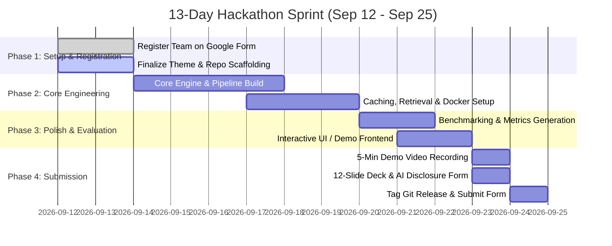

# Samsung PRISM Generative AI Hackathon (3rd Edition 2026–27)
## Comprehensive Strategic Analysis, Theme Breakdown & Participation Playbook

---

## 1. Executive Hackathon Overview

The **Samsung PRISM GenAI Hackathon (3rd Edition)** is organized by the **Language AI Team** and the **PRISM Team** at **Samsung R&D Institute India (SRI-B)**. It is a single-round, high-intensity hackathon where teams must ship a **working prototype** of multimodal, agentic AI solving real-world, industry-defined challenges.

### 🏆 Stakes & Rewards
- **Prizes**: ₹1.5 Lakhs pool for top teams.
- **Samsung R&D Summer Internships**: 2-month summer internship for selected candidates (in Edition 1, all interns converted to Pre-Placement Offers / PPOs; candidates may need to clear the MAGPIE coding test).
- **PRISM Worklets**: Winning teams get to work on funded PRISM worklets under direct Samsung R&D mentorship.
- **IEEE Publications**: Top projects are mentored toward IEEE conference/journal publications (Edition 1 produced 5 IEEE publications).
- **Certificates**: Merit certificates for winners; official participation certificates for all Top 15 shortlisted teams.

---

## 2. Critical Milestones & Immediate Actions

> [!IMPORTANT]
> **Registration Deadline is September 16, 2026 at 11:59 PM (Only 4 Days Away!)**  
> The final submission link will **ONLY** be shared with teams who complete the team registration process before September 16.

| Milestone | Date | Description | Critical Action |
| :--- | :--- | :--- | :--- |
| **Launch & Registration** | **11 Sep 2026** | Problem statements released | Form team & pick theme |
| **Registration Closes** | **16 Sep 2026 (11:59 PM)** | Team registration Google Form closes | **Submit Registration Form ASAP** |
| **Final Submission Closes** | **25 Sep 2026 (11:59 PM)** | Code, Video, PPT & AI Disclosure due | Tagged GitHub release + Google Form |
| **Top 15 Announced** | **09 Oct 2026** | Shortlisted teams for final demo | Preparation for jury Q&A |
| **Final Demo Round** | **15 Oct 2026** | Live pitch & live prototype walkthrough to Samsung Jury | Interactive live demo |
| **Results & Awards** | **24 Oct 2026** | Winners announced | Worklet & internship onboarding |

- **Team Registration Link**: [Google Form](https://forms.gle/NxN6TWXLpcXmTnv66)
- **Official Query Email**: `prism@samsung.com`
- **Team Rules**: Maximum 4 members, all from the **same college**. Naming convention: `CollegeName_TeamName`.

---

## 3. Mandatory Submission Deliverables (Due Sep 25, 11:59 PM)

There is **NO separate ideation round** this year. Teams must submit a fully functional working prototype on day one. Any failure to follow formatting or tagging guidelines leads to direct disqualification.

1. **GitHub Repository (Public or Shared)**:
   - Must contain a release tag named **`PRISM_GENAI_HACKATHON_Y2026`** on your final commit. The jury judges the tagged commit.
   - Comprehensive `README.md` with reproducible setup instructions.
   - Docker support (`Dockerfile` and/or `docker-compose.yml`) for one-command execution.
   - All assets (deck, video link, evaluation reports, test scripts) checked into the repository.
2. **Demo Video (Max 5 Minutes)**:
   - Uploaded to YouTube (Unlisted/Public) or Google Drive (accessible permissions).
   - Must demonstrate the **actual working software** in action (not just slides or code reviews).
3. **Presentation Deck (`CollegeName_TeamName_Submission.pptx`)**:
   - Follow the 12-slide template strictly:
     1. Title, Theme ID, Team Details, GitHub Link
     2. Theme Introduction
     3. Existing Solutions & Gaps
     4. Our Solution & Architecture Diagram
     5. Demo & Product Walkthrough
     6. Tools & Tech Stack
     7. Impact & Use Case
     8. Innovation Highlights, Results & Limitations
     9. What’s Next
     10. Brownie Points (Key Differentiators)
     11. Verification Checklist
     12. Thank You
4. **AI Usage Disclosure Form (`LangAI3.0_AI_Disclosure.docx`)**:
   - Transparently declare all AI tools (ChatGPT, Gemini, Claude, Cursor, Copilot) used across ideation, coding, UI/UX, analysis, and debugging.
5. **Theme-Specific Evaluation Artifacts**:
   - *Theme 1*: `appsretrieval_results.json` generated via MTEB.
   - *Theme 2*: `metrics.md` and `results.jsonl` benchmark reports.
   - *Theme 3*: Installable Android `.apk` + screen-recording test cases.
   - *Theme 4*: System telemetry logs, latency percentiles, and ablation study.
   - *Theme 5*: Virtual clock trace logs adhering to the evaluation harness protocol.

### Scoring Rubric (Round 1)
```
┌─────────────────────────────────────────────────────────────┐
│ Working Prototype & Core Functionality            : 30%    │
│ Technical Depth & Feasibility                     : 25%    │
│ Innovation & Originality                          : 20%    │
│ Relevance to Theme                                : 15%    │
│ Presentation, Documentation & Reproducibility     : 10%    │
└─────────────────────────────────────────────────────────────┘
```

---

## 4. Deep-Dive Analysis of the 5 Themes

### Theme 01: Agentic Code Intelligence
*Find the right code from natural-language queries across massive JavaScript codebases.*

- **Problem**: Voice assistant codebases contain thousands of files with dozens of tools. Code retrieval is the primary bottleneck. Given a natural language query, rank code snippets in order of relevance without reading the entire repo into an LLM context window.
- **Scope & Constraints**:
  - Pure code retrieval and ranking (NDCG@10, MRR). Code generation or text explanations are **out of scope**.
  - Single language: **JavaScript**.
  - Must run on **CPU alone** (minimal/no GPU reliance).
  - P0: Base retrieval accuracy.
  - P1: Retrieval across versions (rebuild indexes/caches fast on code changes/commits).
  - Bonus: Evolutionary retrieval (differentiating nearly identical snippets across commit history).
- **Evaluation Mechanism**: Evaluated on the test split of the **CoIR Apps dataset** (`CoIR-Retrieval/apps` on Hugging Face) using the **MTEB** evaluation library (`mteb.get_task("AppsRetrieval")`).

---

### Theme 02: Smart Guided Troubleshooting Engine
*Transform vague Samsung Galaxy complaints into one-tap, deeplinked troubleshooting plans.*

- **Problem**: Customers describe device issues colloquially ("screen flickers and battery drains"). Customer agents spend 15 minutes mapping this to manual Settings steps. The engine must turn vague text into a structured, ordered, machine-actionable JSON troubleshooting plan in **< 300 ms** for cached queries.
- **Key Pipeline Stages**:
  1. **Query Enrichment**: Normalize colloquial complaint into a canonical query; generate semantic cache key + 8–10 diverse paraphrases.
  2. **Structure Extraction (LLM / Parsing)**: Parse reference text (`siis_responses.json`) into `Goal`, `Action`, `StepGroup`, `Step` following strict Pydantic schemas (`schema.py`).
  3. **Deeplink Mapping & Sequencing**: Match target actions to masked Bixby Settings deeplinks (`deeplinks.json` ~575 URIs). Sequence non-invasive steps first, destructive/critical operations (factory reset, wipe) last.
  4. **Fast-Path Semantic Cache**: Sub-300 ms response for semantic hits.
  5. **REST API Microservice**: Endpoints `POST /v1/troubleshoot` and `GET /health` in Docker.
- **Strict Constraints**:
  - **Zero URL leaks**: Absolute prohibition of web URLs (`samsung.com`, `http://`).
  - **Strict word limits**: Title (2–3 words), Description (5–7 words starting with "It will").
  - **Zero hallucinated steps**: Only derive steps from reference text; return `contexts: []` with fallback `"no_match"` if unresolvable.
  - Action categories: `auto` (has deeplink), `manual` (physical clean/repair), `critical` (reboot/reset, ordered last).

---

### Theme 03: Teachable Voice Automation
*Teach a mobile assistant a flow once by voice + taps; replay it on command across 3rd-party Android apps.*

- **Problem**: Voice assistants fail inside third-party apps (Zomato, Domino's, Amazon). When users demonstrate a sequence of taps, the assistant should capture the UI tree via Android Accessibility / UI Automator, generalize it into a parameterized reusable flow (extracting slots like item, quantity, delivery address), and replay it autonomously on voice commands.
- **Scope & Deliverable**:
  - **Must provide an installable Android APK** + source code + demo video.
  - Must run via Android Accessibility Service / UI Automator (no private APIs, no hardcoded scripts, no web fallbacks).
  - Safety boundary: Absolutely **no credential or payment capture** (must pause and hand off on OTP/payment screens).
- **Evaluation**: 14 rigid test cases (T1 to T14) covering exact replay, paraphrase matching, slot substitution, unexpected promo pop-up dismissal, app language changes, and unknown intent handling.

---

### Theme 04: Streaming Live RAG
*Real-time incremental retrieval, multi-intent decomposition, and state-preserving answer refinement.*

- **Problem**: In full-duplex conversational voice systems, waiting for the user to finish speaking creates dead air. Users speak compound utterances ("check venue capacity in Pune for 30 people, cancellation policy, and catering options") and introduce late-arriving constraints ("actually, the trip was international").
- **Key Pipeline Stages**:
  1. **Retrieval Controller**: Monitors incoming transcript stream (0.0s, 0.8s, 1.6s). Decides whether to `Wait`, `Provisional Retrieve`, or `Suppress`.
  2. **Multi-Intent Decomposer**: Splits compound utterances into orthogonal sub-queries.
  3. **Corpus Hybrid Search & Fusion**: Dense + Sparse (BM25) search with Reciprocal Rank Fusion (RRF).
  4. **Session-Only Delta Refinement**: When new constraints arrive, mutates only affected claims without wiping session memory or re-running full-corpus search.
  5. **Query Suppression**: Suppresses vector queries on stylistic requests ("summarize in two bullets").
  6. **Factual Grounding & Citations**: Strict chunk attribution (`[Doc_ID §Section]`) and explicit uncertainty flags.
- **Evaluation Gates**: G1 (Reproducibility), G2 (Early retrieval >= 80%), G3 (Multi-intent >= 70%), G4 (Grounding >= 85%), G5 (State continuity), G6 (100% Telemetry logs).

---

### Theme 05: Interruptible Real-Time Agents
*Voice-native assistant architecture: dual-process execution, multimodal grounding, and sub-second interruption handling.*

- **Problem**: Humans interrupt and change their minds mid-sentence. Existing voice bots either stall while thinking or discard all progress. Theme 05 requires a dual-process event architecture:
  - **Fast Path**: Sub-300 ms verbal fillers, conversational acknowledgments, and floor holding.
  - **Slow Path**: Async tool execution, multimodal reasoning (audio WAV, camera frames PNG).
  - **Coordination Layer**: Event loop that immediately cancels superseded in-flight tool calls upon interruption, enforces idempotency on state-changing actions (e.g. booking flights), and updates structured state snapshots.
- **Evaluation**: Automated Virtual Clock Streaming Harness with 9 public scenarios and ~60 hidden scenarios. Scored on Task Completion (40%), Interruption Recovery (35%), Latency (15%), Safety (10%).

---

## 5. Decision Matrix: Which Theme Should Your Team Choose?

| Evaluation Dimension | Theme 1: Code Intelligence | Theme 2: Smart Troubleshooting | Theme 3: Voice Automation | Theme 4: Streaming Live RAG | Theme 5: Interruptible Agents |
| :--- | :--- | :--- | :--- | :--- | :--- |
| **Primary Domain** | NLP / Code IR | Enterprise Support API | Mobile OS Automation | Real-time Search / RAG | Concurrency / Real-time Voice |
| **Core Tech Stack** | Python, MTEB, Tree-sitter, Embeddings | Python, FastAPI, Pydantic, Redis/BM25, Docker | Kotlin/Java, Android Accessibility Service | Python (asyncio), FastAPI, Vector DB, WebSockets | Python (asyncio), WebSockets, Multimodal APIs |
| **Starter Data Provided** | Hugging Face Dataset | **Full starter kit (queries, siis, deeplinks, schemas)** | None (must target real apps) | Corpus provided | Evaluation harness post-registration |
| **Demo Impact (Visuals)** | Moderate (Search CLI / UI) | **High (Galaxy UI + One-Tap Sim)** | **Extremely High (Phone Taps Itself)** | **Very High (Live Chunk Streamer)** | High (Live Audio Interruption) |
| **Implementation Risk** | Low (Metric-driven) | **Very Low (Clearly specified contracts)** | **Very High (Android OS flakiness)** | Moderate (Async streaming logic) | High (Virtual clock harness dependency) |
| **Dev Velocity (2-Week Build)** | Fast | **Fastest & Most Deterministic** | Slow (Android APK build cycles) | Fast | Moderate |

---

## 6. Strategic Recommendations for Your Team

### 🥇 Top Recommendation #1: Theme 02 (Smart Guided Troubleshooting Engine)
*Best for: Teams with strong Python, backend, API design, and full-stack capabilities.*
- **Why this wins**:
  1. **Complete clarity**: Samsung provided the exact `schema.py`, starter data (`deeplinks.json`, `siis_responses.json`, `queries.json`), sample I/O pairs, and `metrics.md` template. There is zero ambiguity about what Samsung wants.
  2. **Feasibility**: Can be completely built, optimized, and containerized within 7–10 days, leaving ample time to polish the demo video and deck.
  3. **Showstopper Demo Potential**: In addition to the REST API, you can build a sleek web dashboard simulating a Samsung Galaxy device screen. When a user enters a complaint, the engine returns the structured plan in < 200 ms, and clicking an action triggers the simulated Bixby deeplink right on the Galaxy UI mock!
- **Key Innovation Differentiators**:
  - Two-tier semantic cache (exact embedding hash + cosine threshold) achieving 90%+ hit rate on unseen paraphrases with < 50 ms latency.
  - Hybrid retrieval (BM25 token match + fine-tuned BGE code/intent embeddings) for 100% deeplink precision.
  - Deterministic Pydantic validation pipeline that guarantees 0% schema errors and 0 URL leaks.

---

### 🥈 Top Recommendation #2: Theme 04 (Streaming Live RAG)
*Best for: Teams passionate about cutting-edge LLM architectures, real-time streaming, and interactive visualizations.*
- **Why this wins**:
  1. Highly relevant to Samsung's next-generation Bixby and full-duplex Galaxy AI.
  2. Eliminates mobile OS dependencies while showcasing high technical depth.
  3. Visual appeal: A rich streaming UI showing real-time token arrival, speculative retrieval triggers, intent decomposition trees, and in-place answer delta animations will captivate the jury.
- **Key Innovation Differentiators**:
  - Speculative intent boundary classifier that predicts query completeness with minimal false triggers.
  - Graph-based citation verification ensuring zero hallucinated doc IDs.
  - Delta patch engine for in-place answer updates upon late-arriving constraints.

---

### 🥉 Theme 03 (Teachable Voice Automation) — High Risk, High Reward
*Only choose if: At least 2 team members are experienced Android developers comfortable with Kotlin and `AccessibilityService`.*
- Having a live phone screen automate Zomato and Amazon orders will stun the judges.
- **Risk**: Android OS permissions, UI tree inconsistencies across app updates, and background service crashes make live demos risky unless thoroughly battle-tested.

---

## 7. AI Disclosure Strategy (`LangAI3.0_AI_Disclosure.docx`)

Samsung **encourages** the use of Generative AI tools, provided you disclose them transparently. Complete adherence to this form demonstrates engineering integrity.

### How to Complete the Form:
1. **AI Usage Declaration**: Answer **"Yes"**.
2. **Purposes**: Check all relevant boxes (e.g., *Code generation or assistance*, *Idea brainstorming*, *Testing/debugging*, *UI design*).
3. **Feature Origin Table**:
   - For every major module (e.g., *Semantic Cache Engine*, *Deeplink Retrieval Matcher*, *Pydantic Schema Validator*, *Stream Controller*), classify as **Both (Self + AI)**.
   - Example description:
     > *"Feature: Semantic Caching Layer. Origin: Both. Tools: Gemini / Cursor. Prompt: 'Generate an async semantic cache lookup using Qdrant vector similarity with a 0.88 cosine threshold.' Modification: Refactored fallback handling, integrated custom in-memory LRU cache, and added Pydantic serialization."*
4. **Compliance & Sign-off**: Confirm zero proprietary code misuse and have the Team Lead sign.

---

## 8. 13-Day Step-by-Step Execution Plan (Sep 12 – Sep 25)



### Day-by-Day Roadmap:
- **Days 1–2 (Sep 12–14) [TODAY & TOMORROW]**:
  - Fill out the **Google Registration Form** immediately (Team Name: `CollegeName_TeamName`).
  - Lock in the chosen theme (Theme 2 or Theme 4 recommended).
  - Initialize the GitHub repository with clean folder structure, pre-commit hooks, and initial README.
- **Days 3–6 (Sep 15–18)**:
  - Implement the core processing pipeline (extraction, normalization, ranking, and validation).
  - Implement automated schema validation and zero-leak filters.
- **Days 7–9 (Sep 19–21)**:
  - Implement the fast-path caching layer and API endpoints.
  - Containerize the solution with Docker and verify single-command startup.
  - Run automated benchmarks to generate `metrics.md` / evaluation JSON.
- **Days 10–11 (Sep 22–23)**:
  - Build a visual demo interface (web frontend) to showcase the solution during the video walkthrough.
  - Complete the 12-slide presentation (`CollegeName_TeamName_Submission.pptx`).
- **Days 12–13 (Sep 24–25)**:
  - Record and edit the 5-minute demo video (clear audio, concise problem explanation, live working demo).
  - Complete `LangAI3.0_AI_Disclosure.docx`.
  - Push all files, create the release tag **`PRISM_GENAI_HACKATHON_Y2026`**, test a fresh clone from Docker, and submit the Google Form before 11:59 PM.
